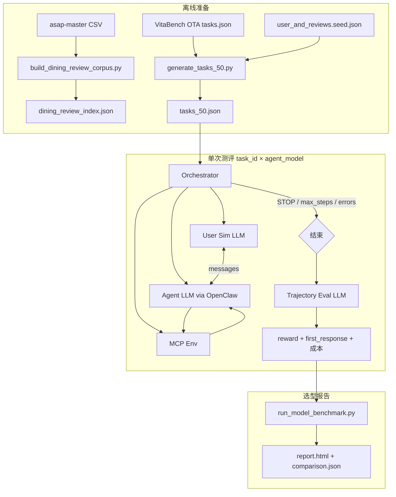

# 6.3 模型选型测评 · 技术方案

> **依据**：`6.3改动对照清单.md`、`6.3测评流程.md`  
> **目标**：在 VitaBench 式 **50 Task + Orchestrator + 双 LLM（用户/裁判）+ rubric reward** 下完成 Agent LLM 选型；Agent 侧保留 OpenClaw + MCP，并落地 **餐饮语料方案 C**。  
> **版本**：2026-06-03 v1

---

## 1. 范围与不在范围

### 1.1 本方案做

| 模块 | 交付 |
|------|------|
| Task 考卷 | 50 条 VitaBench 结构 JSON + 生成/筛选脚本 |
| Orchestrator | User ↔ Agent ↔ Env 三步循环；`max_steps=100`、`max_errors=10` |
| 用户模拟 LLM | `.env` → `user_llm_model` |
| 打分 LLM | 滑动窗口 + rubric reward；`.env` → `judge_llm_model` |
| Agent 改造 | SOUL `###STOP###`、environment 注入、餐饮 2 个 MCP |
| 指标与报告 | 北极星：rubric reward、Full Success、first_response |
| 选型流水线 | 改造 `run_model_benchmark.py` 外壳，替换采集/评分内核 |

### 1.2 本方案不做（或 P2）

- 全量复刻 VitaBench 66 工具 / 订房下单仿真  
- yf_dianping 语料接入  
- 6.2 的 `rubric.json` 主路径、多轮五项脚本指标  
- ToolEval Pass Rate / Win Rate 自动化（文档保留，后续可选）  
- 可进入时间 API（草稿有，当前无数据源，Task rubric 不依赖）

---

## 2. 总体架构



**三个 LLM 隔离**

| 角色 | 环境变量 | 默认模型 | 温度建议 |
|------|----------|----------|----------|
| 被测 Agent | ECS 网关切换 | config `models[]` | 0.3（冻结） |
| 用户模拟 | `user_llm_model` | `deepseek/deepseek-v4-flash` | 0.5～0.7 |
| 打分 | `judge_llm_model` | `openai/gpt-5.5` | 0.0～0.2 |

API：用户/裁判走 OpenRouter 或现有 `.env`（`LLM_API_KEY` / `OPENROUTER_API_KEY`），与 Agent 网关分离。

---

## 3. 目录与新增文件（建议）

```text
meituan-lifecare-agent/
├── lifecare/
│   ├── poi_category.py          # NEW is_dining(type), star_band(star)
│   ├── review_corpus.py         # NEW 读 index、抽 snippet、filter 规则
│   └── clients/amap.py          # MOD 周边搜 place/around
├── run_mcp.py                   # MOD search 参数 + 2 个新 tool
├── workspace/
│   ├── SOUL.md                  # MOD ###STOP###
│   └── skills/
│       ├── local-itinerary-planner/SKILL.md   # MOD 方案 C 顺序
│       └── mock-user-prefs-reviews/SKILL.md   # MOD 新 tool 边界
└── 测试/
    ├── vitabench_eval/          # NEW 6.3 测评内核（建议包名）
    │   ├── orchestrator.py
    │   ├── user_simulator.py
    │   ├── agent_bridge.py      # OpenClaw CLI / session
    │   ├── env_runner.py        # 调 MCP、计 num_errors
    │   ├── trajectory_evaluator.py
    │   ├── task_schema.py
    │   ├── metrics.py           # reward + first_response
    │   └── prompts/             # user_sim + sliding_window yaml
    ├── scripts/
    │   ├── build_dining_review_corpus.py
    │   └── generate_tasks_50.py
    ├── eval_cases/
    │   ├── vitabench/tasks_50.json
    │   └── review_corpus/dining_review_index.json
    └── 模型选型/
        ├── config.json          # MOD datasets.tasks + orchestrator + llm
        ├── run_vitabench_benchmark.py   # NEW 或改造 run_model_benchmark
        └── generate_report_v63.py       # MOD 北极星字段

待修复/模型选型评测/
├── 6.3测评流程.md
├── 6.3改动对照清单.md
└── 6.3技术方案.md               # 本文
```

---

## 4. Task 数据模型与生成

### 4.1 JSON Schema（单条 Task）

```json
{
  "id": "T063_001",
  "domain": "travel_local",
  "difficulty": "medium",
  "requires_dining": true,
  "environment": {
    "time": "2026-08-03 09:00:00",
    "user_id": "u_mock_001",
    "location": [{"address": "...", "longitude": 121.47, "latitude": 31.23}],
    "user_historical_behaviors": {},
    "orders_summary": [],
    "user_reviews": []
  },
  "user_scenario": {
    "user_profile": { "nickname": "阿琳", "饮食禁忌": ["少油"], "...": "..." }
  },
  "instructions": "（保密全文，用户模拟器持有；含分步需求）",
  "evaluation_criteria": {
    "expected_states": [{
      "state_rubrics": ["须基于天气工具给出8月3日预报", "午饭须符合少油偏好"]
    }],
    "overall_rubrics": ["方案含餐饮与景点/文化两类 POI"]
  }
}
```

**字段说明**

| 字段 | 来源 | 备注 |
|------|------|------|
| `environment.location/behaviors/orders` | OTA `tasks.json` 改写 | 去掉订房支付类订单，保留出行相关摘要 |
| `environment.user_reviews` | `user_and_reviews.seed.json` 按 user_id | filter tool 输入 |
| `environment.time` | **默认固定**（见 §12） | 写入 Agent system 与 rubric |
| `requires_dining` | 生成脚本打标 | 决定是否走语料 MCP 链 |
| `instructions` | OTA 改写为本地出行+餐饮 | 不含订房/支付 |

### 4.2 生成流水线 `generate_tasks_50.py`

1. **筛选** OTA 任务：含景点/天气/出行时间/餐饮偏好之一；剔除纯订房支付。  
2. **改写** `instructions`：酒店订单 →「推荐符合偏好的就餐/景点方案」。  
3. **填充** `environment`：映射 VitaBench + seed 用户。  
4. **生成 rubrics**：每条 `instructions` 拆 3～8 条 `state_rubrics` + 0～2 条 `overall_rubrics`（可 LLM 辅助 + 人工抽检 10 条）。  
5. **难度**：easy 15 / medium 25 / hard 10（与 6.2 比例一致）。  
6. 输出：`eval_cases/vitabench/tasks_50.json` + `manifest.json`。

---

## 5. Orchestrator

### 5.1 行为（对齐 VitaBench，参数用本项目值）

参考：`开源参考集/vitabench-main/src/vita/orchestrator/orchestrator.py`

| 配置项 | 值 | 说明 |
|--------|-----|------|
| `max_steps` | **100**（config 可调 80～120） | 一步 = User/Agent/Env 间一次转发 |
| `max_errors` | **10** | MCP 返回 `error` 累计 |
| 正常终止 | User 或 Agent 消息含 `###STOP###` | 同 VitaBench |
| 提前终止 reward | **0** | `max_steps` / `too_many_errors` / `invalid_agent_message` |

### 5.2 主循环（伪代码）

```python
def run(task, agent_model) -> SimulationRun:
    init_environment(task.environment)
    inject_agent_context(task)  # environment 摘要 + 固定 time
    trajectory = []
    step_count = 0
    num_errors = 0
    while not done:
        if from_role == USER and to_role == AGENT:
            agent_msg = agent_bridge.generate(...)  # OpenClaw
            if "###STOP###" in agent_msg.content: done = True
            if agent_msg.tool_calls: to_role = ENV
        elif to_role == ENV:
            for tc in tool_calls:
                tool_msg = env_runner.execute(tc)
                if tool_msg.error: num_errors += 1
        elif to_role == USER:
            user_msg = user_simulator.generate(persona, instructions, history)
            if "###STOP###" in user_msg.content: done = True
        step_count += 1
        if step_count >= max_steps or num_errors >= max_errors:
            termination = ...; reward = 0; break
    return SimulationRun(messages=trajectory, meta={ttft_ms, steps, ...})
```

### 5.3 Agent 桥接 `agent_bridge.py`

- **继续用 OpenClaw CLI**（与现网一致）：`openclaw agent --session-id {task_id}`。  
- 每 Task **新 session**，避免串题。  
- 从 OpenClaw JSON 抽取：`assistant_text`、`tool_calls`、`time_to_first_assistant_text_ms`。  
- 若网关暂不支持完整 tool 轨迹，Orchestrator 侧 **并行** 读 MCP JSONL 日志（`LIFECARE_MCP_TOOL_LOG`）合并进 trajectory（P0 必做，否则裁判看不到 tool 结果）。

---

## 6. 用户模拟 LLM

### 6.1 输入

- `<persona>`：`task.user_scenario.user_profile`  
- `<instructions>`：完整保密指令（Agent **不可见**）  
- 对话历史 + Agent 最新回复  

### 6.2 输出规则

- 首次：部分需求（不全剧透）。  
- 后续：根据 Agent 是否满足 **instructions 要点** 决定是否补充/纠正。  
- 认为满足：`###STOP###` 结束（用户侧 stop）。  
- 人格一致：急躁/亲子等来自 persona。

### 6.3 Prompt

- 基于 VitaBench `user_simulator` 中文模板，改 domain 为本地出行。  
- 文件：`测试/vitabench_eval/prompts/user_simulator_zh.yaml`

---

## 7. 滑动窗口打分 LLM

### 7.1 流程

1. 若 `termination_reason ∈ {max_steps, too_many_errors, invalid_agent_message}` → **reward=0**，跳过 LLM。  
2. `_initialize_rubric_states(task.evaluation_criteria)`，全部 `meetExpectation=false`。  
3. `_create_sliding_windows(messages, window_size=10, overlap=2)`。  
4. 每窗调用 **judge LLM**，模板：`sliding_window_eval_template.yaml`（改「下单」表述为「方案/工具结果可验证」）。  
5. `reward = count(meetExpectation) / count(rubrics)`。

### 7.2 实现策略

- **优先**：移植/薄封装 `evaluator_traj.py`（Python，读 yaml prompt）。  
- Judge 调用：OpenAI 兼容 API，`model=judge_llm_model`，`temperature=0.1`。  
- 持久化：每 task 存 `eval_detail.json`（rubric 状态 + justification），便于答辩与人工抽检。

### 7.3 与 6.3 rubric 原则

- 评 **结果**，不评 skill 顺序。  
- 含餐 Task：rubric 可要求「午饭符合少油且引用 filter/snippet 依据，不得编造 tool 未返回的评论」。  
- 用户模拟器中途改口 **不降低** rubric 标准。

---

## 8. 北极星与辅指标 `metrics.py`

| 指标 | 计算 | 存储字段 |
|------|------|----------|
| **Mean Rubric Reward** | mean(reward) | `mean_rubric_reward` |
| **Full Success Rate** | mean(reward==1.0) | `full_success_rate` |
| **Partial Success**（辅） | mean(reward>=0.8) | `partial_success_rate` |
| **first_response** | 移植 `score_dimensions._score_first_response` | `first_response_score` |
| **First Response Pass** | score>=70 占比 | `first_response_pass_rate` |
| 分难度 | 按 `task.difficulty` 聚合 | `by_difficulty.*` |
| 成本 | token、tool 次数、elapsed、steps P95 | `cost.*` |
| 提前终止率 | termination 触顶占比 | `early_termination_rate` |

旧 `task_success_rate_pct` / 六维加权 **不再写入主报告**，仅 `--legacy` 可选对比。

---

## 9. MCP 与 Agent 改造

### 9.1 扩展 `lifecare_search_places`

| 参数 | 类型 | 说明 |
|------|------|------|
| `origin_lng`, `origin_lat` | float, 可选 | 有则 `place/around` |
| `radius_m` | int, 可选 | 默认：半日 12000、「别太远」5000、一日 25000；可由 Agent/skill 传入 |

实现：`amap.py` 新增 `search_poi_around`；`run_mcp.py` 分支逻辑。

### 9.2 餐饮语料 · 方案 C（2 个新 tool）

#### `lifecare_get_review_snippets`

**入参**

| 参数 | 必填 | 说明 |
|------|------|------|
| `poi_id` | 否 | 日志关联 |
| `poi_name`, `city` | 否 | 返回体展示 |
| `star_band` | 是* | 可由 tool 内根据 `star_for_rank` 推算 |
| `star_for_rank` | 否 | 有则内部映射 band（见对照清单 §1.5.1） |
| `aspect_hints` | 否 | 如 `["少油","口味"]` |
| `limit` | 否 | 默认 3，最大 3 |

**出参**：`{ok, poi_ref, snippets:[{text, stars, aspects, star_band, is_synthetic}], _note}`

**索引**：`eval_cases/review_corpus/dining_review_index.json`，键 `bucket=dining` + `star_band` + aspects。

#### `lifecare_filter_dining_by_reviews`

**入参**

```json
{
  "candidates": [{"id","name","type","star_for_rank","reputation", "snippets":[...]}],
  "user_reviews": [...],
  "constraints": {"dietary":["少油"], "party_size": 2, "price_tier": "value"}
}
```

**出参**

```json
{
  "kept": [{"poi_id","name","reasons":["..."]}],
  "dropped": [{"poi_id","name","reasons":["snippet含重油与少油冲突"]}]
}
```

**规则（确定性，v1）**

1. `is_dining(type)==false` → 原样进 `kept`（不应传入，防御性）。  
2. 用户 `dietary` 与 snippet/user_review 负面词表冲突 → `dropped`。  
3. `star_for_rank` 低于 Task rubric 隐含下限（若有）→ `dropped`。  
4. 其余 → `kept`；同分保留高德 `star_for_rank` 高者（供 Agent Top-K）。

**调用时机**：仅 `requires_dining==true` 或槽位含餐；**玩乐 POI 不调用**。

### 9.3 Skill 改动要点

**`local-itinerary-planner`**：步骤插入

```text
2. search 玩乐 + search 餐饮（分批）
2b. [若含餐] get_review_snippets（对每个餐饮候选）
2c. [若含餐] filter_dining_by_reviews
3. Top-K（餐饮用 kept；玩乐用 reputation+关键词）
4. plan_route …
5. 长文输出（禁止编造未出现在 tool 中的评论原文）
```

**`mock-user-prefs-reviews`**：声明 `is_synthetic`、禁止冒充点评实时库。

**`SOUL.md`**：任务完成回复含 `###STOP###`；environment 摘要读取说明。

---

## 10. 离线语料 `build_dining_review_corpus.py`

### 10.1 输入

- `asap-master/data/train_sample_anonymized.csv`（或 `train.csv` 抽样 ≤5000 行）  
- `user_and_reviews.seed.json` 中 `reviews[]`

### 10.2 处理

1. ASAP 行 → 截断 `review` 至 ≤200 字；`star` → `star_band`；列 `dish_taste` 等 → `aspects` 字典（仅保留非 -2 维）。  
2. seed 短评 → 同样映射 `star_band`。  
3. 每条 `{snippet_id, bucket:"dining", star_band, aspects, text, is_synthetic:true}`。  
4. 按 `star_band` 分桶，每桶保留 ≥30 条（不足则重复抽样 + 改写前缀）。

### 10.3 输出

`eval_cases/review_corpus/dining_review_index.json`：

```json
{
  "_meta": {"version": 1, "source": ["asap","seed"], "license_note": "ASAP Apache-2.0 offline only"},
  "snippets_by_band": {
    "band_4_5": [ {...}, ... ]
  }
}
```

### 10.4 高德 POI 对应（运行时，非离线绑 id）

见对照清单 **§1.5.1**：POI 定店；语料按 **star_band + aspects** 挂演示短评，**不**用店名查 ASAP。

---

## 11. 选型流水线改造

### 11.1 `config.json` 新增段（示例）

```json
{
  "version": "2026-06-03-v1",
  "datasets": {
    "tasks": {
      "path": "eval_cases/vitabench/tasks_50.json",
      "cases": 50
    }
  },
  "orchestrator": {
    "max_steps": 100,
    "max_errors": 10,
    "agent_timeout_s": 180
  },
  "llm": {
    "user_simulator": {"env_model": "user_llm_model", "temperature": 0.6},
    "evaluator": {"env_model": "judge_llm_model", "temperature": 0.1}
  },
  "metrics": {
    "first_response_pass_threshold": 70,
    "partial_success_reward_threshold": 0.8
  },
  "models": [ "...现有 6 模型..." ]
}
```

### 11.2 运行命令（目标态）

```powershell
cd meituan-lifecare-agent/测试

# 0) 离线准备（一次性）
python scripts/build_dining_review_corpus.py
python scripts/generate_tasks_50.py

# 1) 冒烟 1 task × 1 agent
python vitabench_eval/run_benchmark.py --task-id T063_001 --model doubao --dry-run-eval

# 2) 全量 50 × 6 模型
python 模型选型/run_vitabench_benchmark.py --run-id 20260603-v63 --models doubao,qwen,...

# 3) 报告
python 模型选型/generate_report_v63.py --run-id 20260603-v63
```

### 11.3 与 6.2 共存

- `collect_openclaw_pred.py` + `run_agent_eval.py` **保留**，标记 `legacy`；6.3 主成绩只认 `vitabench_eval` 输出。  
- ECS：`remote_ecs_collect.py` 增加 `--pipeline vitabench|legacy` 开关，默认 `vitabench`。

---

## 12. 待拍板项（技术建议）

| 项 | 建议 | 理由 |
|----|------|------|
| **environment.time** | **固定写入 Task** | rubric 可复现；答辩可解释「8月3日天气」 |
| **被测模型** | **先保留 6 模型** | 已有 ECS 切换；与 6.3 文档「四模型」可后减 |
| **Full Success 阈值** | 主报 **reward=1.0**；辅报 **≥0.8** | 答辩两条线，不丢中间态 |

---

## 13. 实施阶段与工时（粗估）

| 阶段 | 内容 | 依赖 | 估时 |
|------|------|------|------|
| **P0** | `poi_category` + `build_dining_review_corpus` + 2 MCP + skill/SOUL | 无 | 2～3 人日 |
| **P1** | `generate_tasks_50` + 10 条人工抽检 rubric | P0 | 2～3 人日 |
| **P2** | Orchestrator + user_sim + agent_bridge + MCP 日志合并 | P1 | 3～4 人日 |
| **P3** | trajectory_evaluator + metrics + 1 task smoke | P2 | 2～3 人日 |
| **P4** | run_benchmark + report_v63 + ECS | P3 | 2 人日 |
| **P5** | 全量 50×6 + 隐藏卷 15 Task 化 | P4 | 跑数 12～30h + 1 人日 |

**里程碑验收**

- P0：`lifecare_filter_dining_by_reviews` 单测通过（含 kept/dropped reason）。  
- P3：1 Task 端到端 reward + first_response 有值。  
- P5：`report.html` 含三项北极星 + 分难度 + 提前终止率。

---

## 14. 测试与 smoke

| 用例 | 命令/方法 | 期望 |
|------|-----------|------|
| 语料索引 | `build_dining_review_corpus.py` | 各 band ≥30 条 |
| snippet 工具 | MCP 调 `get_review_snippets(star_band=band_4_5)` | 返回 1～3 条，`is_synthetic=true` |
| filter 工具 | 少油约束 + 重油 snippet | `dropped` 含 reason |
| Orchestrator 触顶 | mock task 死循环 | `max_steps` → reward=0 |
| 首响 | 正常 task | `first_response_score` ≤100，有 ttft 时 ≥70 若 <10s |
| 无餐饮 task | `requires_dining=false` | 轨迹无 filter/review 调用（除非 Agent 误调，rubric 不强制） |

---

## 15. 风险与缓解

| 风险 | 缓解 |
|------|------|
| OpenClaw 轨迹缺 tool 详情 | MCP JSONL + Orchestrator 合并 |
| Judge 与人工不一致 | 抽 10 Task 人工标 rubric，算 κ |
| ASAP 与 POI 星级 band 失真 | 答辩声明演示语料；rubric 评「是否引用 tool」非「评论真伪」 |
| 50 Task 生成质量 | 隐藏卷 15 + 人工抽检 |
| 成本 | 用户/裁判 LLM 固定；Agent 全量可分批 |

---

## 16. 文档索引

| 文档 | 用途 |
|------|------|
| `6.3改动对照清单.md` | 需求与指标对照 |
| `6.3测评流程.md` | 流程与 VitaBench 引用 |
| `6.3技术方案.md` | 本文：实现规格 |
| `VitaBench工具与赛题5对照.md` | 工具域对照 |
| `meituan-lifecare-agent/测试/模型选型/技术方案.md` | 6.2 legacy 说明 |

---

## 17. 修订记录

| 日期 | 版本 | 说明 |
|------|------|------|
| 2026-06-03 | v1 | 首版，对齐改动对照清单全部已确认项 |
| 2026-06-03 | v2 | 落地 P2～P3：`vitabench_eval` 内核、OpenClaw 适配、ECS smoke |

---

## 18. 实现状态（v2，对照美团代码）

### 18.1 与 VitaBench 原版的差异（ intentional ）

| VitaBench | 本仓库 6.3 实现 | 原因 |
|-----------|-----------------|------|
| User ↔ Agent ↔ **Env** 三步，Agent 逐步 tool_call | **User ↔ Agent** 为主；Env 由 **OpenClaw 内嵌 MCP** 执行 | 赛题 Agent 已接 OpenClaw + `run_mcp.py`，与 6.2 采集一致 |
| Environment 类 + DB | Task `environment` JSON + 首轮 `[仿真环境]` 注入 | 无订房/支付仿真库 |
| Agent LLM 在 Orchestrator 内 | **`agent_bridge.py`** 调 `openclaw agent --json` | 网关切换被测模型 |
| tool 结果在 trajectory ToolMessage | **`env_runner.py`** 读 `mcp_tool_calls.jsonl` 的 `result_preview` 合并为 `role=tool` | 技术方案 §5.3 P0 |
| `evaluator_traj.py` 整文件移植 | **`trajectory_evaluator.py`** 薄封装 + 中文 prompt | 依赖 OpenRouter/DashScope HTTP |

### 18.2 已落地文件（`meituan-lifecare-agent/测试/`）

| 组件 | 路径 | 状态 |
|------|------|------|
| Orchestrator | `vitabench_eval/orchestrator.py` | ✅ max_steps=100, max_errors=10, STOP, MCP 合并 |
| 用户模拟 LLM | `vitabench_eval/user_simulator.py` + `prompts/user_simulator_zh.yaml` | ✅ `.env` → `user_llm_model` |
| Agent 桥接 | `vitabench_eval/agent_bridge.py` | ✅ OpenClaw + `OPENCLAW_GATEWAY_TOKEN` + environment 注入 |
| Env / MCP | `vitabench_eval/env_runner.py` + `lifecare/mcp_tool_log.py` + `run_mcp.py` | ✅ 天气/搜点/路线写 `result_preview` |
| 滑动窗口 Judge | `vitabench_eval/trajectory_evaluator.py` + `prompts/sliding_window_eval_template.yaml` | ✅ 窗 10 重叠 2；reward=满足率 |
| 指标 | `vitabench_eval/metrics.py` | ✅ first_response |
| Task 校验 | `vitabench_eval/task_schema.py` | ✅ |
| 单题入口 | `vitabench_eval/run_benchmark.py` | ✅ 输出 `*_run.json` + `*_eval_detail.json` |
| 批量外壳 | `模型选型/run_vitabench_benchmark.py` | ✅ |
| ECS smoke | `模型选型/remote_vitabench_smoke.py` | ✅ |
| 配置 | `模型选型/config.json` → `v63` 段 | ✅ |
| Task 数据 | `待修复/模型选型评测/data/`（50 条） | ✅ |
| SOUL STOP | `workspace/SOUL.md` §6.3 | ✅ |

### 18.3 ECS Smoke 验证（2026-06-04）

| 项 | 结果 |
|----|------|
| Task | `T063_007` 苏州园林半日 · qwen3.6-plus · temp=0.0 · thinking=medium |
| Orchestrator | ✅ 3 steps · `termination=user_stop` |
| 用户模拟 LLM | ✅ `.env` → `user_llm_model` |
| Agent | ✅ OpenClaw + MCP（weather / search / route） |
| Env 合并 | ✅ JSONL → trajectory `role=tool` |
| 滑动 Judge | ✅ 3 窗 · **reward=0.75（6/8 rubric）** |
| 产物 | `测试/模型选型/results/v63-smoke/qwen_T063_007_run.json` |

ECS 运维：`agent_bridge` 适配 OpenClaw `{result.payloads}`；Qwen thinking 须 `maxTokens=66000`；`ecs_fix_pairing.py` 批准 CLI scope；禁用损坏 feishu 插件。

### 18.4 仍属 P0/P1 未做（不影响单题 smoke）

- 餐饮语料 MCP（`get_review_snippets` / `filter_dining_by_reviews`）与 `build_dining_review_corpus.py`
- `lifecare_search_places` 的 `origin_lng/lat/radius_m` 扩展
- `generate_report_v63.py`、全量 50×6 ECS 批跑
- `remote_ecs_collect.py --pipeline vitabench`（暂用 `remote_vitabench_smoke.py`）

### 18.5 运行命令

```powershell
# 本地单题（需 OpenClaw + .env 三 LLM Key）
cd meituan-lifecare-agent/测试
python vitabench_eval/run_benchmark.py --task-id T063_007

# ECS smoke（qwen3.6-plus, temp=0.0, thinking=medium, 含 Judge）
python 模型选型/remote_vitabench_smoke.py --model qwen --task-id T063_007 --temperature 0.0 --thinking medium
```

### 18.6 三 LLM 配置（仓库根 `.env`）

| 变量 | 用途 |
|------|------|
| `user_llm_model` | 用户模拟器 |
| `judge_llm_model` | 滑动窗口打分 |
| `qwen_model` / 网关 primary | 被测 Agent（ECS 切换） |
| `OPENROUTER_API_KEY` + `OVERSEAS_PROXY_HTTPS` | Judge（及 user 若走 OR） |
| `deepseek_api_key` | user 备选直连 |
| `DASHSCOPE_API_KEY` / `qwen_api_key` | Qwen Agent |
