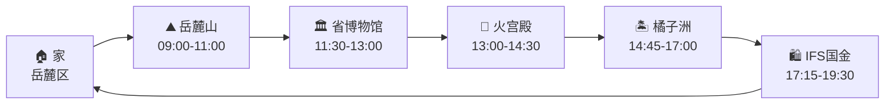

# Qwen 方案类输出样例（长文结构参考）

> **提示词来源清单**（SOUL / skills 与样例每一块的对应关系）：见同目录 [qwen方案类输出-提示词清单.md](./qwen方案类输出-提示词清单.md)

> **来源**：6.3 测评 batch 中 Qwen3.6-Plus 对「长沙亲子一日」场景的一次真实 Agent 回复（任务 T063_030，用户满意结束）。  
> **说明**：线上 https://121.41.81.58:8080/ 与测评共用同一套 SOUL.md + local-itinerary-planner skill，**方案长文格式应与此同类**；真实网页**不需要**文末 ###STOP###（仅测评用户模拟器用）。  
> **工具**：本条回复前已调用天气、高德 POI 搜索、路线规划；正文含 POI 链接与高德头图。  
> **非此类**：用户只问「明天冷不冷」时，SOUL 要求短答、不出全套行程表。

---

# 🗺️ 军哥·长沙亲子一日游玩方案（6岁崽）

**谁**：军哥 + 6岁儿子（2人）  
**哪**：长沙市区  
**多久**：全天（约 09:00–20:00）  
**主题**：经典地标 + 博物馆 + 亲子商场一站式，辣度可控

---

## 🌤️ 明日天气（6月26日 周五）

| 天气 | 最低温 | 最高温 | 降水 |
|------|--------|--------|------|
| 阴 | 23°C | 31°C | 无 |

> 阴天不晒，适合户外走动。但气温偏高，注意给崽带水壶、防晒帽，中午前后尽量安排室内（博物馆/商场）。

---

## 📍 动线总览

```
家(岳麓区) → 岳麓山(晨游) → 湖南省博物馆(室内) → 火宫殿(午餐)
→ 橘子洲(下午) → IFS国金中心(晚餐+商场) → 回家
```



---

## 📋 行程速览表

| 时段 | 做什么 | 交通方式 | 备注 |
|------|--------|----------|------|
| 09:00–09:15 | 出发 → 岳麓山 | 打车约 1.4km / 15分钟 | 从麓山南路出发，很近 |
| 09:15–11:00 | ⛰️ **岳麓山** 晨游 | 步行+观光车 | 爱晚亭、岳麓书院外围，带崽走平缓路线 |
| 11:00–11:40 | 岳麓山 → 省博物馆 | 打车约 9.6km / 40分钟 | 避开正午高温 |
| 11:40–13:00 | 🏛️ **湖南省博物馆** | 室内步行 | 马王堆汉墓陈列，6岁崽看辛追夫人+文物 |
| 13:00–14:30 | 🍜 **火宫殿·坡子街总店** 午餐 | 打车约 6.4km / 22分钟 | 湘菜老字号，有儿童餐/不辣菜可选 |
| 14:45–17:00 | 🏝️ **橘子洲** 下午 | 打车约 2.2km / 9分钟 | 坐小火车环洲，看毛泽东青年雕像 |
| 17:15–19:30 | 🛍️ **IFS国金中心** 晚餐+逛商场 | 打车约 4.4km / 12分钟 | 商场内有儿童游乐区，一站式解决 |
| 19:30–20:00 | 回家 | 打车约 5km / 15–20分钟 | 崽累了正好车上睡 |

---

## 🕐 分时段展开

### ⓵ 09:00–11:00 岳麓山晨游


从家出发打车 **1.4km / 约15分钟** 到岳麓山南门。

- **推荐路线**：南门进 → 爱晚亭（拍照打卡）→ 岳麓书院外围逛逛 → 原路返回或坐观光车下山
- **带6岁崽注意**：不要爬山顶！走山脚平缓步道即可，全程约 1.5–2 小时，崽不会太累
- 岳麓书院门票 40元/人（1.2m以下儿童免票），爱晚亭免费
- [岳麓山详情 →](https://www.amap.com/place/B0FFG0BPT6)

### ⓶ 11:30–13:00 湖南省博物馆


打车 **9.6km / 约40分钟**，正好避开中午最热时段，进馆吹空调。

- **必看**：马王堆汉墓陈列（辛追夫人、素纱襌衣）—— 6岁崽可能对"千年不腐"很感兴趣
- **亲子提示**：馆内有互动展区，可以提前在"湖南博物院"微信公众号预约（免费，需实名）
- 建议停留 1–1.5 小时，崽注意力有限，挑重点看
- [省博物馆详情 →](https://www.amap.com/place/B02DB00018)

### ⓷ 13:00–14:30 午餐 · 火宫殿·坡子街总店


打车 **6.4km / 约22分钟**。

- **为什么选它**：长沙湘菜老字号，坡子街总店最有氛围，人均 50–80 元
- **带崽点菜建议**：
  - ✅ 不辣/微辣：糖油粑粑（崽最爱）、臭豆腐（微辣）、红烧肉、蒸蛋
  - ✅ 大人加菜：剁椒鱼头、小炒黄牛肉（可要求少辣）
  - ❌ 避免：口味虾、超辣菜
- 火宫殿有小吃拼盘，适合带娃家庭一次尝多种
- [火宫殿坡子街总店 →](https://www.amap.com/place/B02DB02DH4)

### ⓸ 14:45–17:00 橘子洲


打车 **2.2km / 约9分钟**，很近。

- **怎么玩**：买小火车票（40元/人，1.2m以下免票），环洲一圈约 40 分钟，中途可下车
- **推荐停靠**：毛泽东青年艺术雕塑（必拍照）→ 问天台 → 江边步道
- 全程约 2 小时，江边有风比市区凉快
- 橘子洲免费入园，小火车另购票
- [橘子洲详情 →](https://www.amap.com/place/B02DB05Z1Q)

### ⓹ 17:15–19:30 IFS国金中心 · 晚餐+商场


打车 **4.4km / 约12分钟**。

- **晚餐**：商场内有多家餐厅可选，推荐：
  - 费大厨辣椒炒肉（湘菜，可要求微辣）
  - 或商场内其他亲子友好餐厅（人均 60–100 元）
- **崽的安排**：IFS 内有儿童游乐区/抓娃娃机，大人吃饭时崽有得玩
- **大人逛逛**：KAWS 雕塑打卡（7楼露台）、各品牌店
- [IFS国金中心 →](https://www.amap.com/place/B0HAK9J7KY)

### ⓺ 19:30–20:00 回家

打车约 5km / 15–20 分钟回到岳麓区。崽玩了一天，车上大概率秒睡 😄

---

## 💰 预算参考（2人）

| 项目 | 费用区间 | 说明 |
|------|----------|------|
| 交通（全天打车6段） | 60–100 元 | 长沙打车起步价低，总里程约 30km |
| 岳麓山 | 0–80 元 | 入园免费；岳麓书院 40元×1（崽免票） |
| 省博物馆 | 0 元 | 免费预约 |
| 午餐（火宫殿） | 80–150 元 | 2人，含小吃拼盘+2–3个菜 |
| 橘子洲小火车 | 0–40 元 | 入园免费；小火车 40元×1（崽免票） |
| 晚餐（IFS商场） | 100–180 元 | 2人，商场餐厅 |
| 零食/水/纪念品 | 30–60 元 | 灵活 |
| **合计** | **270–610 元** | 人均 135–305 元 |

> 以上为估算，实际以到店为准。

---

## 💡 Tips

1. **预约**：湖南省博物馆需提前在「湖南博物院」微信公众号预约，建议今晚就约明天的票（免费但限流）
2. **辣度控制**：火宫殿点菜时直接说"有6岁崽，菜做微辣/不辣"，长沙餐厅基本都能配合
3. **防暑**：明天最高 31°C，给崽带：水壶、防晒帽、薄外套（博物馆/商场空调冷）
4. **推车**：6岁崽走一天可能累，橘子洲和商场段如果家里有轻便推车可以带上
5. **备选方案**：如果下午崽太累不想逛橘子洲，可以直接去 IFS 商场，里面有室内游乐场，省掉户外段
6. **停车**：岳麓山/省博物馆/IFS 都有停车场，自驾也方便；但长沙市区停车费不低，打车更省心

---

军哥，这个方案把户外（岳麓山、橘子洲）和室内（博物馆、商场）穿插开了，中午最热时段安排在博物馆吹空调，带6岁崽不会太折腾。你看看有没有想调整的？比如：
- 想加个专门的亲子乐园？
- 午饭想换别的湘菜馆？
- 或者哪天出发时间要改？
