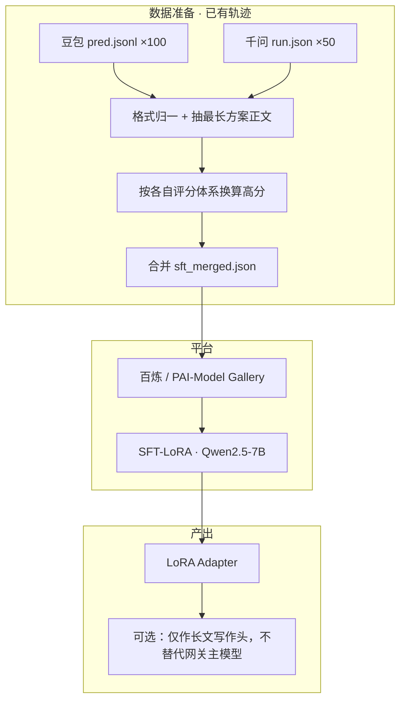
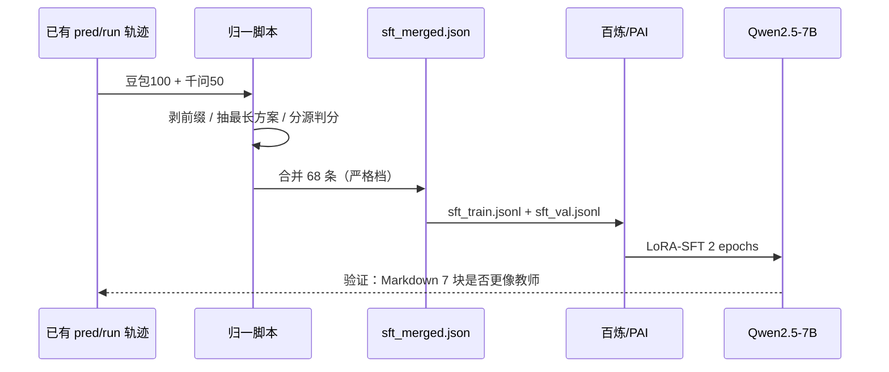
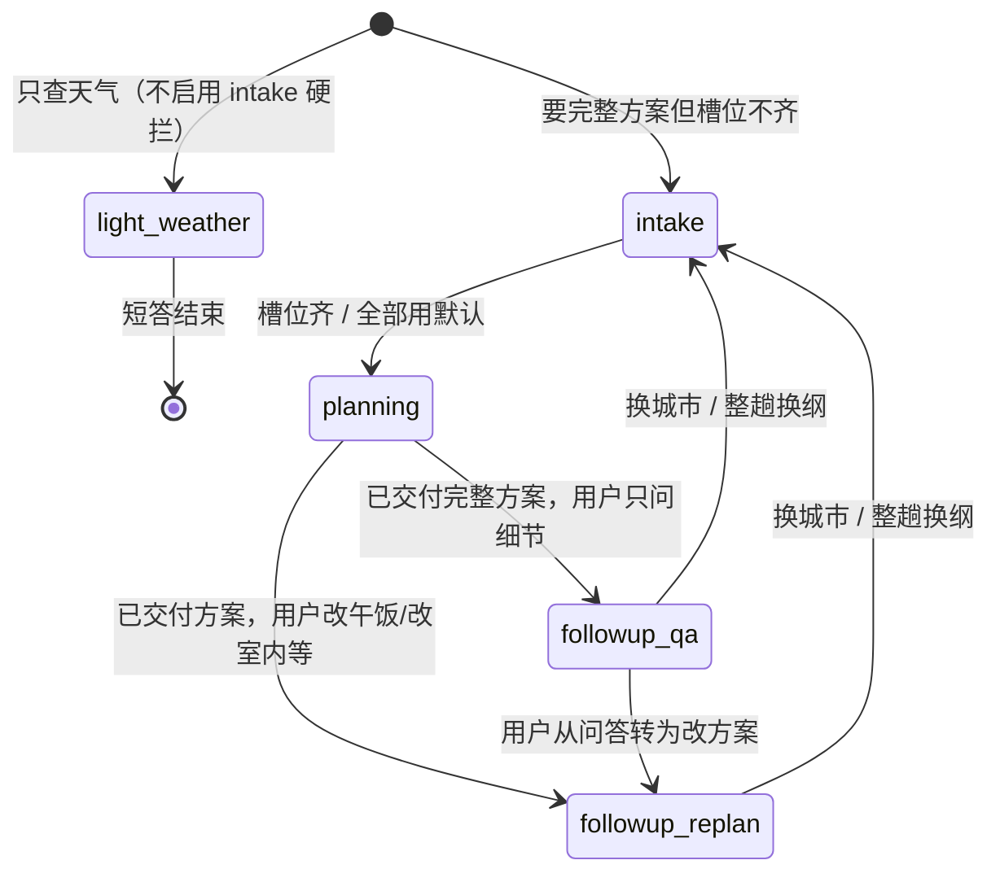

## 基于阿里云的 Qwen2.5-7B-Instruct 微调方案（修订版）

> **修订说明**：本版不再依赖「716 条 Qwen3.6 生成数据」或 500 条考卷补数。  
> 数据来源改为仓库内已有的 **豆包 + 千问测评轨迹**（约 100～150 条），抽取 `instruction` + `output` 后合并为一份训练 JSON。  
> 重点回答三件事：**两边格式是否一致**、**≥80 分怎么判**、**怎么安全合并进 SFT**。

---

### 一、方案概述

对 **Qwen2.5-7B-Instruct** 做 LoRA-SFT，教师数据来自：

| 来源 | 文件位置 | 条数 | 输出形态 |
|------|----------|------|----------|
| 豆包 mini | `待修复/模型选型评测/结果/runs/20260602-full/doubao/pred_*.jsonl` | 100（50 单轮 + 50 多轮） | `assistant_text` Markdown 长文 |
| 千问 3.6 Plus | `meituan-lifecare-agent/测试/模型选型/results/v63-batch/qwen/T063_*_run.json` | 50 | `trajectory` 里 assistant `content` |

**目标**：不新增 API 跑数，把现有轨迹洗成统一 Alpaca JSON → 转 `.jsonl` → 上传百炼/PAI 微调。

**现实规模**：原始约 **150 条**；按统一高分口径筛后约 **68 条**可用（严格档，脚本实测）。这是试点规模，不是原先文档写的 500～716 条。

---

### 二、技术架构图（修订）



---

### 三、你最担心的两个问题

#### 3.1 豆包和千问「格式不一样」怎么办？

**结论：内容都是 Markdown 长文，但版式、长度、前缀不一致。不能直接 raw 拼接，必须先归一。**

| 维度 | 豆包 | 千问 | 合并策略 |
|------|------|------|----------|
| 存储字段 | `assistant_text` / `turns[].assistant_text` | `trajectory[role=assistant].content` | 统一落到 `output` |
| 常见前缀 | `[[reply_to_current]]` | 偶发英文思考句 `Now I have all the data...` | **剥离前缀**，只保留方案正文 |
| 标题风格 | `# 主方案：…`、`## 行程概览` | `# 🗺️ …方案`、`## 📋 行程速览表` | **保留 emoji 标题也可**，SFT 学的是结构不是字面模板 |
| 平均长度（抽样） | ~800 字，偏短、紧凑 | ~3000 字，偏长、信息密 | 只取 **含方案标记** 的最长 assistant 段（见脚本） |
| Mermaid | 较少 | 较多 | 不强制删；统一保留 Markdown |
| 工具轨迹 | `tools_in_order` | `trajectory` 内 `tools` + `role=tool` | **本方案 SFT 不训练工具调用**，只训「最终可见长文」 |
| 输出类型 | ❌ 不是 JSON 行程对象 | ❌ 不是 JSON 行程对象 | **`output` 一律用 Markdown 字符串**，不要改成旧版文档里的 JSON |

与线上 Agent 对齐的真实格式是 **SOUL + local-itinerary-planner 规定的 7 块 Markdown**（标题、天气、速览表、分时段、动线、预算、Tips），不是 `{"days":[...]}`。

**归一规则（写入抽取脚本）：**

1. `instruction` = 用户侧文本（豆包：`user_messages` 拼接；千问：trajectory 里 `role=user` 首条或全文拼接）。
2. `output` = 该 case 中 **最长** 且命中方案标记的一段 assistant 文本。
3. 方案标记（命中 ≥2 项才视为「完整方案」）：`行程`、`速览`、`预算`、`Tips`/`tip`、`天气`、`##` 标题。
4. 剥离：`[[reply_to_current]]`、纯 intake 选择题（无方案标记且 `tools_in_order` 为空）。
5. 元数据保留：`source`（`doubao`/`qwen`）、`score`、`case_id`，便于复查，**不进训练字段**。

这样合并后，模型学到的是 **同一业务的 Markdown 方案文风**，而不是两种互斥格式。

#### 3.2 「大于 80 分」到底怎么判定？

**结论：豆包和千问用的是两套评分，数字不能直接横向比。必须分开判，再换算到统一门槛。**

##### 豆包：0～100 分的规则引擎

- 脚本：`meituan-lifecare-agent/测试/run_agent_eval.py` + `rubric_engine.py`
- 分数：`eval_*.json` → `results[].total_score`（0～100）
- 维度权重见 `score_dimensions.json`（首响 15%、补槽 15%、工具 25%、方案完整 20% 等）
- 系统默认 **及格线 `pass_threshold = 60`**，不是 80

```json
// score_dimensions.json
"pass_threshold": 60
```

因此旧文档写「≥80 分」是 **人为收紧的筛选线**，比官方 pass 更严。

**豆包高分判定（推荐）：**

```
保留条件：total_score >= 80
         且 output 为完整方案长文（非纯 intake）
```

当前仓库实测：100 条里约 **60 条** 同时满足 ≥80 分 + 完整方案长文（从 `turns` 抽最长段后计数）。

##### 千问：0～1 的 rubric 命中率（6.3 裁判）

- 脚本：`meituan-lifecare-agent/测试/vitabench_eval/trajectory_evaluator.py`
- 分数：`report_stats.json` / `*_eval_detail.json` → `reward = rubric_met / rubric_total`
- 裁判：GPT 滑动窗口读 trajectory，逐条 rubric 判 `meetExpectation`
- **没有** 豆包那种 `total_score` 六维加权

**千问高分判定（推荐）：**

```
保留条件：reward >= 0.8   （等价于「100 分制约 80 分」的命中率）
         且 agent_error 为空
         且 output 为完整方案长文
```

当前仓库实测：50 条里约 **8 条** `reward >= 0.8`；若放宽到 `reward >= 0.75` 约 **15～20 条**。

##### 统一换算表（合并数据集时用）

| 来源 | 原始字段 | 统一高分条件 | 统一分 `score_100`（可选，仅排序用） |
|------|----------|--------------|--------------------------------------|
| 豆包 | `total_score` | `total_score >= 80` | 直接用 `total_score` |
| 千问 | `reward` | `reward >= 0.8` | `round(reward * 100)` |

> **注意**：两边的 80 分 **语义相近但不等价**。豆包含「首响/工具链」过程分；千问只看任务 rubric 是否满足。  
> 合并时建议：**分源筛选，不要混用一个阈值文件**；若总样本太少，千问可降到 `reward >= 0.75`，豆包维持 `80`。

##### 不建议的做法

- ❌ 把千问 `reward=0.62` 和豆包 `total_score=62` 当成同一档
- ❌ 无评分记录的 pred 直接进训练（会掺入 gateway 失败、空输出）
- ❌ 用「平均分 81.9」反推每条都 ≥80（平均分高 ≠ 条条 ≥80）

---

### 四、数据抽取与 JSON 生成

#### 4.1 目标文件结构

先产出 **`sft_merged.json`**（数组），再转 **`sft_train.jsonl`**。

```json
{
  "id": "doubao_st_350",
  "source": "doubao",
  "case_id": 350,
  "score_raw": 91,
  "score_100": 91,
  "instruction": "我跟朋友今晚在杭州玩\n选择题答案：第1题选A；第2题选B；第3题选D：一共5人",
  "output": "# 杭州5人今晚河坊街文化休闲行程\n\n**总览**：5位朋友今晚在杭州..."
}
```

字段说明：

| 字段 | 必填 | 说明 |
|------|------|------|
| `instruction` | ✅ | 用户意图 + 必要多轮上下文（简短即可） |
| `output` | ✅ | 归一后的 Markdown 完整方案 |
| `source` | 建议 | `doubao` / `qwen`，方便审计 |
| `score_100` | 建议 | 统一排序、划分 train/val |

#### 4.2 抽取脚本（可直接改路径运行）

```python
import json
import re
from pathlib import Path

ROOT = Path(r"D:\projects\meituan hackathon")
OUT = ROOT / "待修复/测评后改进/sft_merged.json"

PLAN_MARKERS = ("行程", "速览", "预算", "天气", "##", "Tips", "tip", "mermaid")

def is_plan_text(text: str) -> bool:
    if len(text) < 400:
        return False
    hits = sum(1 for m in PLAN_MARKERS if m.lower() in text.lower())
    return hits >= 2

def clean_assistant(text: str) -> str:
    text = re.sub(r"^\[\[reply_to_current\]\]\s*", "", text.strip())
    text = re.sub(r"^Now I have all the data\.[^\n]*\n+", "", text, flags=re.I)
    return text.strip()

def pick_best_output(candidates: list[str]) -> str:
    cleaned = [clean_assistant(t) for t in candidates if t and t.strip()]
    plans = [t for t in cleaned if is_plan_text(t)]
    pool = plans or cleaned
    return max(pool, key=len) if pool else ""

def load_doubao() -> list[dict]:
    base = ROOT / "待修复/模型选型评测/结果/runs/20260602-full/doubao"
    items = []
    for split in ("singleturn", "multiturn"):
        pred_path = base / f"pred_{split}.jsonl"
        eval_path = base / f"eval_{split}.json"
        scores = {
            r["case_id"]: r["total_score"]
            for r in json.loads(eval_path.read_text(encoding="utf-8"))["results"]
        }
        for line in pred_path.read_text(encoding="utf-8").splitlines():
            row = json.loads(line)
            cid = row["case_id"]
            if scores.get(cid, 0) < 80:
                continue
            texts = [row.get("assistant_text") or ""]
            for t in row.get("turns") or []:
                texts.append(t.get("assistant_text") or "")
            output = pick_best_output(texts)
            if not is_plan_text(output):
                continue
            instruction = "\n".join(row.get("user_messages") or [])
            items.append({
                "id": f"doubao_{split}_{cid}",
                "source": "doubao",
                "case_id": cid,
                "score_raw": scores[cid],
                "score_100": scores[cid],
                "instruction": instruction,
                "output": output,
            })
    return items

def load_qwen() -> list[dict]:
    qdir = ROOT / "meituan-lifecare-agent/测试/模型选型/results/v63-batch/qwen"
    stats = json.loads((qdir / "report_stats.json").read_text(encoding="utf-8"))
    reward_map = {r["id"]: r.get("reward") for r in stats["rows"]}
    items = []
    for run_path in sorted(qdir.glob("T063_*_run.json")):
        task_id = run_path.stem.replace("_run", "")
        reward = reward_map.get(task_id)
        if reward is None or reward < 0.8:
            continue
        row = json.loads(run_path.read_text(encoding="utf-8"))
        users = [m["content"] for m in row.get("trajectory", []) if m.get("role") == "user"]
        assistants = [m["content"] for m in row.get("trajectory", []) if m.get("role") == "assistant"]
        output = pick_best_output(assistants)
        if not is_plan_text(output):
            continue
        items.append({
            "id": f"qwen_{task_id}",
            "source": "qwen",
            "case_id": task_id,
            "score_raw": reward,
            "score_100": round(reward * 100),
            "instruction": "\n".join(users[:3]),
            "output": output,
        })
    return items

def main():
    data = load_doubao() + load_qwen()
    OUT.write_text(json.dumps(data, ensure_ascii=False, indent=2), encoding="utf-8")
    print(f"merged={len(data)} doubao={sum(1 for x in data if x['source']=='doubao')} "
          f"qwen={sum(1 for x in data if x['source']=='qwen')}")

if __name__ == "__main__":
    main()
```

#### 4.3 JSON → jsonl（百炼 / PAI）

```python
import json
from pathlib import Path

src = Path("待修复/测评后改进/sft_merged.json")
data = json.loads(src.read_text(encoding="utf-8"))

# 9:1 划分（样本少时 val 至少留 5 条）
split = max(5, int(len(data) * 0.1))
val, train = data[:split], data[split:]

def to_jsonl(rows, path):
    with open(path, "w", encoding="utf-8") as f:
        for item in rows:
            f.write(json.dumps({
                "instruction": item["instruction"],
                "input": "",
                "output": item["output"],
            }, ensure_ascii=False) + "\n")

to_jsonl(train, "sft_train.jsonl")
to_jsonl(val, "sft_val.jsonl")
```

#### 4.4 预期条数（基于当前仓库）

| 筛选档 | 豆包 | 千问 | 合计 |
|--------|------|------|------|
| 严格（豆包 ≥80，千问 reward≥0.8） | 60 | 8 | **68** |
| 宽松（豆包 ≥80，千问 reward≥0.75） | 60 | 22 | **82** |
| 不筛分、只筛「有长文方案」 | ~63 | ~48 | **~111**（噪声大，不推荐） |

**推荐先用严格档 68 条做试跑**；若验证集 loss 不稳，再用宽松档（82 条）补千问样本。

---

### 五、模型与平台（沿用原方案，规模调小）

#### 5.1 底模：Qwen2.5-7B-Instruct

- 7B + LoRA：单卡 4090 可训，显存约 18～22GB
- 与教师模型（千问 API / 豆包）同族中文能力强，适合蒸馏「写法」

#### 5.2 LoRA 参数（样本 ≤100 时）

| 参数 | 推荐值 | 小样本说明 |
|------|--------|------------|
| `r` | 16 | 可保持 |
| `lora_alpha` | 32 | 可保持 |
| `lora_dropout` | 0.05 | 防过拟合 |
| `num_train_epochs` | **2** | 100 条以内建议 2 轮，避免背题 |
| `learning_rate` | 2e-5 | 可保持 |
| `per_device_train_batch_size` | 2～4 | 视显存 |

#### 5.3 平台与费用

- **百炼**：试跑最快，按 token 计费，68 条量级费用可忽略
- **PAI-Model Gallery**：便于管理 LoRA 权重与 OSS 数据集
- 上传：`sft_train.jsonl`、`sft_val.jsonl` → OSS → 创建 SFT-LoRA 任务

---

### 六、微调 Qwen2.5-7B 到底能帮什么、帮不了什么

结合你们架构（**OpenClaw + MCP 工具 + SOUL/Skill + Harness**），判断如下。

#### 微调**可能**提升的（如果数据格式改对）

| 能力 | 说明 |
|------|------|
| **长文写作形态** | 7 段结构、表格密度、分段标题、语气风格 |
| **intake 问卷格式** | 先出 2～3 道选择题，再进规划 |
| **约束在文案里的体现** | 素食/轮椅/预算/人数写进方案 |
| **中文领域表达** | 本地生活、出行管家话术 |

本质是 **「教师模型（豆包/千问）→ 学生模型（7B）」的风格/格式蒸馏**，不是能力提升。

#### 微调**很难**提升的（你们测评的主要短板）

| 能力 | 原因 |
|------|------|
| **工具调用正确性** | 纯文本 SFT 不学 function calling；工具链在 OpenClaw 侧 |
| **POI/天气真实性** | 7B 会背训练里的店名，上线没 MCP 就幻觉 |
| **复杂多轮改方案** | 7B 推理上限远低于 Qwen3.6-Plus |
| **测评 hard 场景** | 雨天改室内、人数陷阱、非法拒答等，靠 100 条学不稳 |
| **首响速度** | 本地 7B 可能更快，但长文质量会掉 |

你们已有 `线上Agent-Harness约束方案.md`，路线是 **Harness 运行时兜底 + SOUL/Skill 软约束**。对当前赛题 Agent，**Harness + 提示词迭代 ROI 通常高于 7B 微调**。

#### 和方案目标的张力

方案写「训练最经济的学生模型本地部署」——这意味着用 7B **替换** Qwen3.6 API。以现有数据量和 Agent 复杂度，**7B 很难达到现网 Qwen3.6 的测评分**（你们 qwen v63 平均 reward 才 0.587，教师都不完美，蒸馏会更差）。

微调更合理的定位是：

- **不是**替代 Qwen3.6 的主模型
- **而是**（可选）做一个「只负责写最终 Markdown 长文」的轻量写作头，工具仍由 OpenClaw 调

---

### 七、工作流程图



---

### 八、核验清单

- [ ] 已确认豆包用 `total_score >= 80`，千问用 `reward >= 0.8`（两套分开判）
- [ ] `output` 为 Markdown 长文，**不是** JSON 行程对象
- [ ] 已剥离 `[[reply_to_current]]` 与纯 intake 无方案样本
- [ ] `sft_merged.json` 中豆包/千问条数与预期一致（严格档：豆包 60 + 千问 8 = 68）
- [ ] train/val 已划分（建议 9:1，val ≥5 条）
- [ ] LoRA `epochs=2`（小样本），微调后抽样生成 5 条看版式是否混成「豆包短 + 千问长」两种极端
- [ ] 部署预期已对齐：**不替代** OpenClaw 主模型，仅作写法蒸馏或实验

---

### 九、优缺点（修订）

#### ✅ 优点

- **零新增 API 成本**：吃现有 150 条轨迹
- **评分可溯源**：豆包 `eval_*.json`、千问 `report_stats.json` 可逐条核对
- **格式与线上一致**：训练 Markdown 7 块，与 SOUL/前端渲染一致

#### ⚠️ 缺点与风险

- **样本少**：严格档 68 条，过拟合风险高
- **双源版式差异**：豆包偏短、千问偏长，合并后 7B 可能文风摇摆 → 靠归一 + 统一高分筛选缓解
- **80 分不可横比**：豆包 80 ≠ 千问 0.8 的严格等价，答辩时要说明两套体系
- **不能替代 Harness**：工具错误、幻觉 POI 仍需工程层解决

---

### 十、提升规划 rubric 命中率（Harness + Skill，优先于 LoRA）

> 微调 7B 主要改「写法」；**测评 rubric 命中率**（千问 `reward`、豆包 `task_success`）要靠 **工具真调了、文案真兑现了检查清单**。  
> 下列为已确认要落地的改进；与 `docs/线上Agent-Harness约束方案.md` 对齐。

#### 10.1 【易懂版】阶段状态机是什么？（对应 `forbidden_tools_before_intake`）

**一句话**：仅当用户要走 **「完整出行方案 → 长文」** 这条链路时，给对话贴标签并 **在错误阶段硬拦工具**；**单独查天气、纯闲聊等轻量场景不启用**，避免误伤。

##### 什么时候启用状态机？（先看意图，再贴标签）

| 用户意图 | 是否启用本节状态机 | Harness 怎么做 |
|----------|-------------------|----------------|
| **要规划/安排行程**（「帮我规划半日」「带娃去哪玩」） | ✅ 启用 | 走 `intake` → `planning` → `followup_*` |
| **只查天气**（「杭州未来一周天气」「明天冷吗」） | ❌ **不启用** | 视为 `light_weather`：允许只调 `get_weather`，**不**强制问卷、**不**拦 `get_weather`、**不要求** checklist / POI 白名单 |
| **纯闲聊**（「你好」「谢谢」） | ❌ **不启用** | 短答即可，不调 lifecare 工具 |
| **已有方案后的追问/改版** | ✅ 启用（从 `followup_*` 进入） | 见下表③ |

> 对齐 SOUL：**只问天气、只闲聊 → 不启动行程规划**。状态机和 `forbidden_tools_before_intake` 的硬拦 **只服务于「要出完整方案长文」**，不要套在「查天气」上。

##### 启用后：可以想成餐厅点餐三步

| 步骤 | 本项目叫什么 | 用户在干什么 | Agent 该干什么 | 不该干什么 |
|------|-------------|-------------|---------------|-----------|
| ① 先问清楚 | `intake`（补槽） | 要**完整方案**但没说几人、几时、去哪类 | 出 2～3 道选择题，复述还缺啥 | **禁止**调 `search_places`、`plan_route`（= `forbidden_tools_before_intake`） |
| ② 做方案 | `planning`（出长文） | 槽位齐了，或「全部用默认」 | 调天气 → 搜 POI → 算路 → 写 Markdown 长方案 | 不要再整套问卷 |
| ③ 方案之后 | `followup_qa` / `followup_replan` | 已有完整方案，追问或改午饭 | 只问答 **或** 改槽后重出方案 | 换城市要回到 ① |

**状态机** = 仅在「规划长文」意图下，后台记纸条：`intake / planning / followup_qa / followup_replan`（或 `light_weather` 等轻量态 **不走** intake 硬拦）。

**为什么要硬拦？** 只在 **① intake** 且 **意图=要完整方案** 时：模型常「偷跑」去搜店，测评记 `forbidden_tools_before_intake`。  
**硬拦** = MCP/网关侧：`stage=intake` **且** `planning_intent=true` 时，拒绝 `search_places` / `plan_route`；**`light_weather` 不拦 `get_weather`**。

**槽位齐才切 `planning`**：城市、人数、时段等齐了（或「全部用默认」）→ 开放搜点/算路 + 10.2 的 checklist / POI 校验。



---

#### 10.2 已采纳的改进项

> **总原则**：下列 A～H 里带 checklist / 硬拦 / POI 校验 / 熔断的项，默认只作用于 **「要出完整方案长文」**（`planning` / `followup_replan`）；**单独查天气、闲聊** 走轻量路径，不套同一套重规则。

##### A. 出方案前 checklist（打掉「声称完成但缺块」）

**时机**：仅在 **`planning` 或 `followup_replan` 且即将发出最终 Markdown 长方案时** 执行（纯 intake 选择题、纯天气短答、followup 只问答 **不跑** 全套 checklist）。

在最终 Markdown 发出前，用规则扫一遍是否含：

| 检查项 | 规则 |
|--------|------|
| 天气块 | 正文有天气段落，且本轮会话调过 `get_weather` |
| 结构块 | 有「行程速览表」+ 分时段展开 |
| 预算块 | 有预算参考表（可标注估算） |
| POI 可核对 | 每个写入方案的 POI 能对应 `amap_place_url` 或工具 JSON 里的 `id` |
| 路程依据 | 至少 1 处写明 `plan_route` 的分钟/公里（或表格交通列） |

**缺块怎么办**：优先 **自动补模板段落**（如空预算表、天气占位+「请以出发前 App 为准」）；补不齐再触发一次 **只补缺失块** 的短重写（比整篇重生成便宜）。

##### B. 会话阶段 + 硬拦工具（与 10.1 落地）

**适用范围**：仅 `planning_intent=true`（用户要 **完整出行方案长文**）时启用；`light_weather` / 纯闲聊 **不写入** intake 硬拦逻辑。

- 规划长文链路四态：`intake` / `planning` / `followup_qa` / `followup_replan`
- 轻量态（可选）：`light_weather` — 只调 `get_weather`，无 questionnaire、无 POI 硬拦
- **`intake` + 规划意图** 时 **硬拦** `search_places`、`plan_route`（不拦 `get_weather` 给「只查天气」场景；只查天气应直接进 `light_weather`，不进 `intake`）
- 槽位齐才切 `planning`

##### C. POI 接地校验（打掉编造 POI）

**适用范围**：同 checklist，仅 **`planning` / `followup_replan` 发出完整长方案前**。

**一句话**：本轮 `search_places` 拿到了哪些店/景点，用户最终看到的方案里 **具体推荐点只能来自这份列表**；对不上的在 **Harness 内部** 替换或去掉，**不把「需重新检索」等工程话术发给用户**。

---

###### C.1 【易懂版】白名单是什么？

想象 Agent 刚用高德搜了一圈，工具返回类似：

```json
{
  "pois": [
    { "id": "B02DB02DH4", "name": "火宫殿(坡子街总店)", "amap_place_url": "https://www.amap.com/place/B02DB02DH4" },
    { "id": "B02DB00018", "name": "湖南省博物馆", "amap_place_url": "..." }
  ]
}
```

Harness 把 **本轮 planning 任务里所有 `search_places` 调用** 的 `pois[]` 合并，得到一张表，就是 **白名单**：

| 高德 id | 标准名 name（工具返回） |
|---------|-------------------------|
| B02DB02DH4 | 火宫殿(坡子街总店) |
| B02DB00018 | 湖南省博物馆 |

方案长文里如果写「午餐去 **火宫殿坡子街总店**」「参观 **省博物馆**」，就要能在这张表里 **对上一个**；对不上（例如「文和友龙虾馆」但本轮从没搜到过）→ **内部** 判不在白名单，**静默换成** 白名单里同类型、同时段的真实店名+链接，用户只看到改好后的正文。

---

###### C.2 怎么判定「一个 POI 在不在白名单」？（推荐算法）

**第一步：建白名单（发长文前做一次）**

```text
whitelist_ids   = 本轮所有 search_places 返回的 poi.id
whitelist_names = 本轮所有 search_places 返回的 poi.name（做规范化，见下）
```

「本轮」= 当前这次出完整方案所关联的工具调用（`planning` 或 `followup_replan` 重搜之后的那批），不是历史会话里很久以前的搜索。

**第二步：从方案正文里找出「候选 POI」**

不必扫描每一个汉字，只抓 **像在具体推荐某地** 的片段，优先级从高到低：

| 优先级 | 正文里长什么样 | 例子 |
|--------|----------------|------|
| ① 最强 | Markdown 高德链接里带 `place/` 后的 id | `[火宫殿→](https://www.amap.com/place/B02DB02DH4)` |
| ② 强 | 加粗/标题里的具体店名景点名 | `### 午餐 · 火宫殿·坡子街总店` |
| ③ 中 | 表格「做什么」列里的具体点位 | 速览表一行写「湖南省博物馆」 |
| 不抓 | 纯泛指、无具体店名 | 「附近商场」「某湘菜馆」「午餐自理」—— **不做白名单校验** |

**第三步：逐个候选 POI 判定**

```text
对每个候选 POI：

  规则 A（有高德链接）：
    从 URL 抽出 id（如 B02DB02DH4）
    若 id ∈ whitelist_ids → ✅ 在白名单
    否则 → ❌ 不在白名单（链接指向从未搜过的店）

  规则 B（只有店名文字、无链接）：
    把候选名、whitelist_names 都做「规范化」后比对：
      - 去掉空格、括号、全角半角
      - 去掉常见后缀差异：「店」「餐厅」「风景名胜区」等（可选）
      - 子串包含：候选名包含某条 whitelist_name，或反过来
    若任一条 whitelist_name 匹配 → ✅ 在白名单
    否则 → ❌ 不在白名单

  规则 C（可选放宽）：
    若正文写了「人均 xx 元」且同一行有 amap 链接且 id 命中 → 即使店名简写也通过
```

**判定示例**

| 方案里写的 | 白名单里有 | 结果 |
|------------|-----------|------|
| 链接 `.../place/B02DB02DH4` | id B02DB02DH4 | ✅ |
| 「火宫殿坡子街总店」 | name `火宫殿(坡子街总店)` | ✅（规范化后子串匹配） |
| 「文和友（海信广场店）」 | （本轮未搜到） | ❌ 编造 |
| 「IFS 国金中心」 | name `IFS国金购物中心` | ✅（去掉空格匹配） |
| 「建议商场内找餐厅」 | — | ⏭ 跳过（泛指，不校验） |

**第四步：不在白名单怎么办（仅内部处理，用户无感）**

> **原则**：POI 校验是 **发用户前的最后一道闸门**。用户看到的永远是 **已替换成真实检索结果** 的方案，不出现「需重新检索确认」「校验未通过」等内部用语。

| 内部动作 | 用户最终看到什么 |
|----------|------------------|
| **优先：就地替换** | 用白名单里 **同槽位、同类型** 的 POI 替换编造名（如午餐位 → 白名单里另一家湘菜 + 正确 `amap_place_url`），段落语气不变 |
| **次选：内部短重写** | 仅把未命中片段交给模型重写，**约束：店名必须来自 whitelist**，仍不暴露 Harness 过程 |
| **兜底：删该锚点** | 若无法合理替换（如白名单里没有餐饮），**删掉这一个点**，用相邻真实 POI 串顺动线；**不** 留空槽写「请自行检索」 |
| **仍不够：内部再搜** | Harness 触发 **仅内部** 一次 `search_places`（补关键词），扩充白名单后再替换，仍不向用户展示「正在重试」 |

**禁止对用户展示**：`需重新检索确认`、标红提示、校验失败、POI 不在白名单 等 —— 这些只写 **结构化日志**（`harness_audit.jsonl`）供测评复盘。

测评口径：千问 rubric「POI 须来自工具返回」— 用户可见正文里的 **可核对点名** 均能在白名单找到依据；达标靠 **内部替换后的终稿**，不是靠给用户看警告。

---

###### C.3 实现时注意（避免误伤）

- **只校验「具体推荐点」**，不校验「西湖」「长沙」等城市名、交通方式、用户住址
- **分店名**：`火宫殿(五一路店)` 与 `火宫殿(坡子街总店)` 是 **不同 id**，不能只因为都叫「火宫殿」就放过；替换时须用 **同 id** 或 **同一条** whitelist 记录的标准名+链接
- **多轮 `followup_replan`**：用户改午饭后若 **新调了** `search_places`，白名单用 **新一轮** 结果重建，内部对旧稿未命中项再替换一遍
- **降级场景**（CUQPS 失败、白名单为空）：**不向用户发带假店名+假链接的长方案**；内部要么重试搜点，要么产出 **无具体店名** 的时段骨架（「午餐：商圈内餐饮，人均区间…」），或走 10.2 H 的用户向降级句（「实时检索暂不可用，建议出发前用高德确认」）— **仍不是** 「需重新检索确认」这种开发用语

---

###### C.4 落地清单（实现时）

1. 从本轮 `search_places` 返回建 **白名单**（`id` + 规范化 `name` + `amap_place_url`）
2. 从长文 Markdown 抽候选 POI（链接 id 优先，其次店名）
3. 按 C.2 规则 A/B 判定；未命中 → **内部** 替换 / 短重写 / 补搜（C.2 第四步）
4. **仅当终稿全部命中或已替换完成** → 流式/一次性发给用户（gateway-chat-ui）
5. 未命中与替换记录写入 **内部日志**，不对用户展示

##### D. 天气 rubric 专用句（写入 `local-itinerary-planner` / SOUL）

**适用范围**：写入 **完整长方案** 时；纯天气短答不适用「必须单独一节出行日天气」。

> 方案必须单独一节「明日/出行日天气」，数值来自 **本轮** `get_weather`；若工具返回日期与用户出行日不一致，**明文说明**并建议出发前再查，**禁止**静默编造气温/降水。

##### E. 可执行性模板（抬 `executability` 维）

**适用范围**：仅完整长方案的速览表 / 分时段块。

- 速览表「交通」列强制格式：`打车约 X km / Y 分钟`（数据来自 `plan_route`），每个时段至少 1 次
- **场景 B（周边）**：SOUL 加硬约束——单程打车宜 **≤40 分钟**；`plan_route` 超距须在正文 **预警**并建议更近锚点

##### F. 多轮路由写清（抬多轮 `task_success`）

| 用户行为 | 模式 | 正确做法 |
|----------|------|----------|
| 改午饭 / 改室内 / 改人数 | 大阶段二 · 模式② | **必须重出完整方案**，不能只短答几句 |
| 换城市 / 周边↔跨城 | 整趟换纲 | **回到大阶段一**（可再走 intake），禁止在旧方案上打补丁 |

**SOUL 末尾补充反例**（摘自 `测试/Bad_Case排查思路.md`）：

- **case 23（改室内）**：反例——用户说「下雨了改室内」后 Agent 仍大段户外景点；正例——复述改室内 → 重搜博物馆/商场 → 新一版全表。
- **换城类**：反例——用户说「不去杭州了改上海」仍在杭州 POI 上改两个字；正例——视为新行程，重新问卷或确认槽位 → 上海工具链 → 新方案。

##### G. 保证 trajectory 里能看见 tool 结果

6.3 裁判读的是 **完整对话轨迹**；若网关只有 assistant 长文、没有 `role=tool` 的返回体，会判「没查天气 / POI 编造」。

**必须稳定**：Orchestrator 合并 `mcp_tool_calls.jsonl` → trajectory 的 `role=tool`（`result_preview` 或完整 JSON）。  
否则 rubric 命中率 **有硬上限**，改 prompt 也救不回来。

##### H. 工具失败与降级（高德 CUQPS 等）

- `search_places` 返回 `CUQPS_HAS_EXCEEDED_THE_LIMIT` 或 `ok: false` 时：方案里 **写明降级**（「实时检索暂不可用，以下为基于常识的备选，请出发前自行确认」），**禁止**硬编带 `amap_place_url` 的「伪实时 POI」
- 天气工具失败：禁止写具体℃；改为「未能获取实时天气，建议出行前查看天气预报」

---

#### 10.3 不需要或需调整的项

##### （1）工具调用顺序：仅「完整方案长文」阶段强制

**不采纳**「所有对话都必须 `get_weather → search_places → plan_route`」的写法。

| 场景 | 是否强制工具链 |
|------|----------------|
| `intake` 出选择题 | 否，**不调** 任何搜点/算路 |
| 纯查天气 / 闲聊 | 否，只调 `get_weather` 或不调工具 |
| `planning` / `followup_replan` 出 **完整长方案** | **是**，建议顺序：`get_weather` → `search_places`（可多轮关键词）→ `plan_route`（相邻点成对） |
| `followup_qa` 只答某一节 | 否，默认不调工具；用户明确要换店再按需调 |

在 `local-itinerary-planner` 里把顺序约束写在 **「何时使用」= 出首版/改版完整方案** 小节，避免模型在 intake 阶段也被暗示去搜点。

**禁止条款**（仍保留，但仅适用于 planning 阶段）：

- 未在本轮 `search_places` 结果中出现过的 POI，**不得**写进方案当「已检索确认」
- 天气工具失败或日期错位时，**不得**写「实时气温 xx℃」

##### （2）`detect_retry_exceeded`：≠「plan_route 调了很多次」；且 **仅长文方案阶段** 启用 Harness 熔断

**适用范围（与 10.1 一致）**：

| 场景 | 是否做 Harness 重复调用熔断 |
|------|---------------------------|
| `planning` / `followup_replan` 出完整长方案 | ✅ 启用（防真死循环） |
| `light_weather` 只查天气 | ❌ 不启用（用户问一周天气，调 1 次 `get_weather` 即可，勿套「连调熔断」） |
| `intake` 出选择题 | ❌ 不启用（本就不该调搜点/算路） |
| `followup_qa` 只问答 | ❌ 默认不启用 |

测评脚本里的 `detect_retry_exceeded` 看的是 **`tools_in_order` 里同一工具名连续出现 > 2 次**（`max_consecutive=2`），**不是** `plan_route` 总次数——且该规则是 **批跑打分用**，线上 Harness 应更细、且 **只在长文规划阶段** 生效。

```text
【仅 planning / followup_replan 长文阶段】

合法（算路多段）：
  search → plan_route → plan_route → search → plan_route
  （A→B、B→C 成对算路，总次数多 ≠ 死循环）

合法（连续多段 route，参数不同）：
  plan_route(A,B) → plan_route(B,C) → plan_route(C,D)
  （Harness 按 **起终点参数指纹** 区分，不按工具名计数熔断）

应熔断（真·没进展，仅长文阶段）：
  search_places(关键词=博物馆) ×3，参数相同且仍 count=0
  plan_route(同一 origin/dest) ×3，返回相同错误或空

【light_weather 等轻量场景】
  不做上述熔断；单次 get_weather 失败则短答降级文案即可
```

**本项目 Harness 建议**：

- **不要**对 `plan_route` 用「连续出现次数」一刀切；**N 个锚点 ≈ N−1 段路线** 是正常行为
- 「没进展」= **相同工具 + 相同参数** 连续失败/空结果 ≥2～3 次 → 仅在该次 **长文规划任务** 内熔断并提示改关键词或降级
- **不采纳**全局「同一工具连调 ≥3 次就熔断」；答辩时说明：**成对算路是设计行为**；熔断只绑在 **出完整方案** 链路上

**与测评脚本的关系**：`process_metrics.detect_retry_exceeded` 仍可能因连续 3 个 `plan_route` 误伤批跑分；线上 Harness 用参数指纹；批跑解读时 **规划类 case** 与 **纯天气 case** 分开看。

---

#### 10.4 与微调的关系（避免重复劳动）

| 手段 | 主要提升 |
|------|----------|
| 本节 Harness + Skill | rubric 命中率、POI/天气真实性、多轮改方案 |
| 前文 LoRA 微调 | Markdown 版式、语气、intake 问卷写法 |

**建议顺序**：先做 10.2 → 重跑 50 条看 `reward` 是否上升 → 仍缺「写得像样」再考虑 68 条 SFT。

---

### 十一、总结

本修订方案的核心是：**用仓库里已有的豆包/千问长文轨迹，分源判分、归一 Markdown、合并成一份 JSON 再 SFT**。

- 不需要 Qwen3.6 重新生成，也不需要 500 条考卷。
- 「≥80 分」对豆包是 `total_score`，对千问是 `reward≥0.8`，**分开判定后再合并**。
- 格式差异通过「抽最长方案 + 剥前缀 + 统一 Markdown output」解决，**不要**强行改成 JSON。
- 以 68 条严格样本做试跑合理；要明显提升测评主分，优先 **第十节 Harness + Skill**（见阶段状态机、出方案 checklist、POI 接地），微调 7B 只作写法蒸馏备选。
