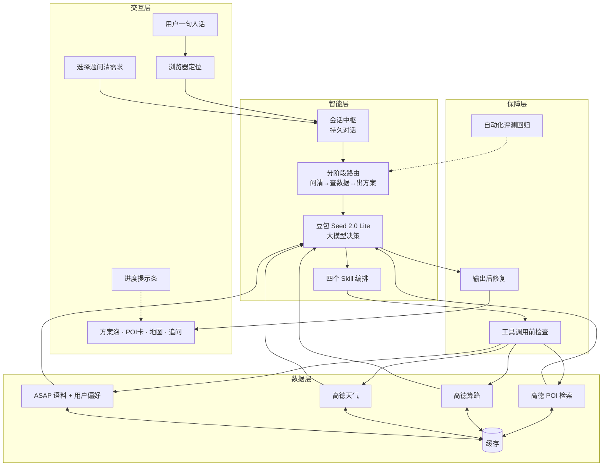
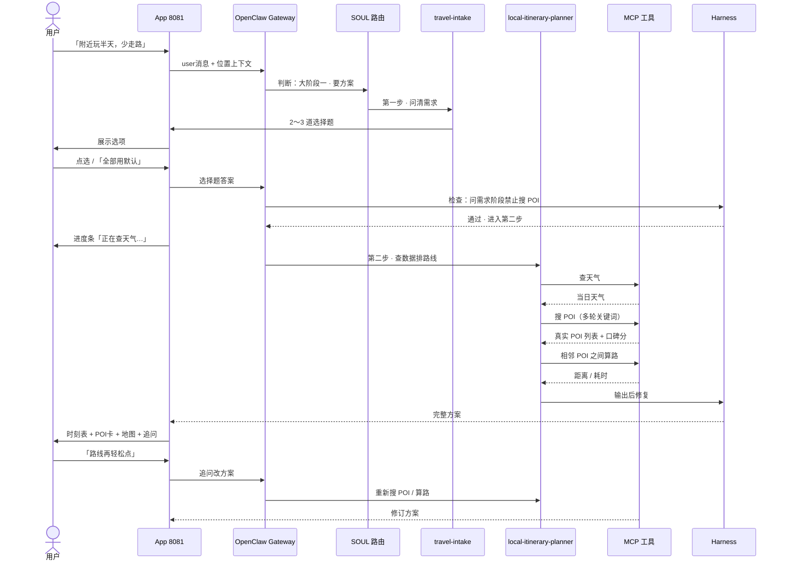
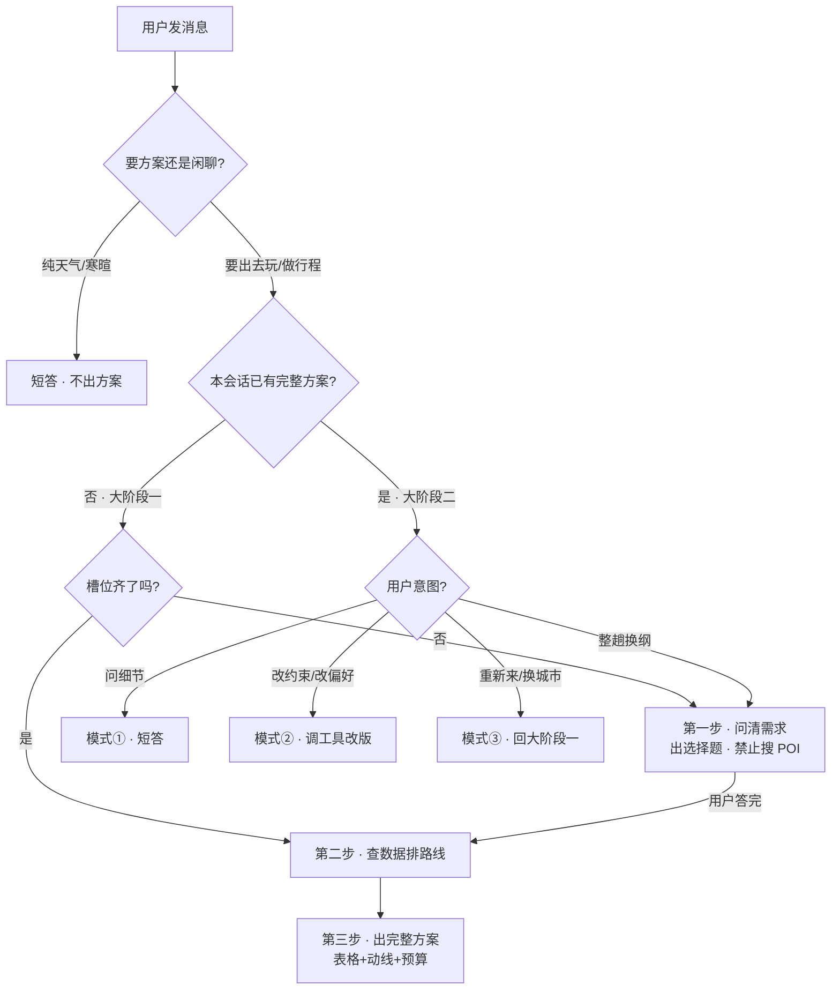
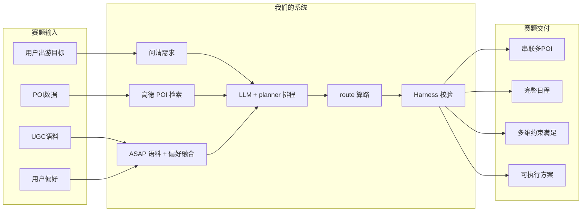
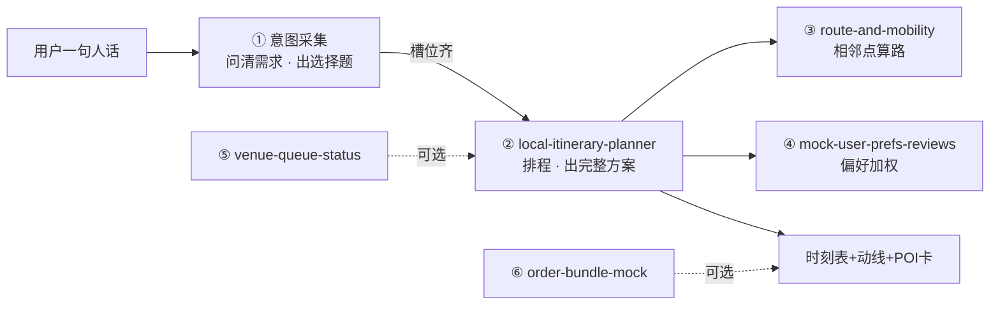
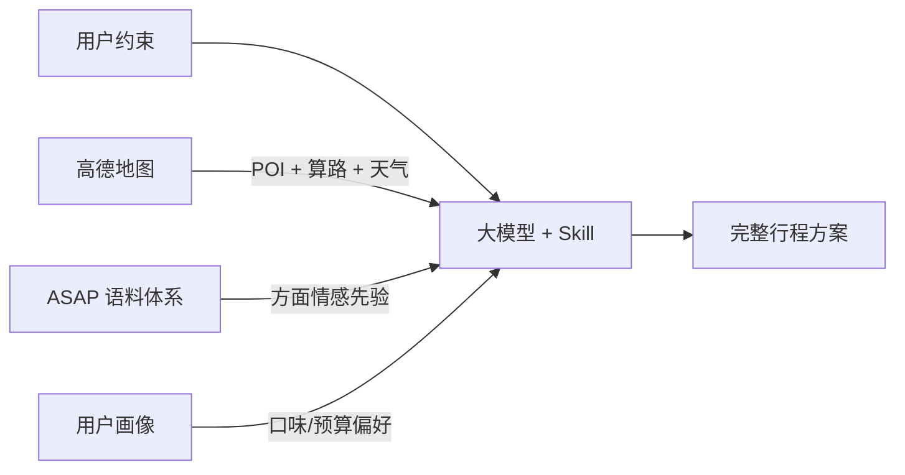
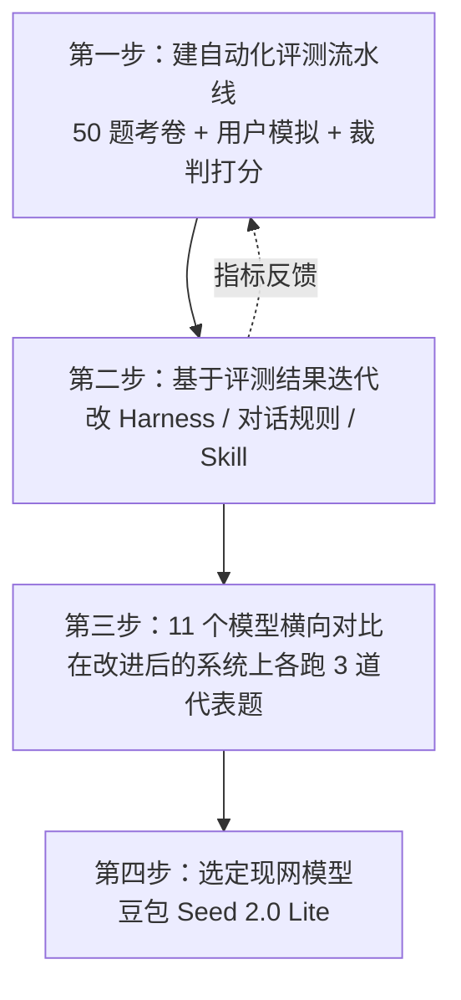

# 路演答辩稿：产品定位与技术架构

> **用途**：决赛 PPT 撰写、答辩口播、赛题要求对照  
> **作品**：现在就出发 — AI 本地路线智能规划管家  
> **C 端产品名**：点评管家  
> **在线 Demo**：App `https://121.41.81.58:8081` · Web `https://121.41.81.58:8080`  
> **最后更新**：2026-07

---

## 目录

1. [产品定位](#1-产品定位)
2. [竞品怎么介绍自己](#2-竞品怎么介绍自己)
3. [用户痛点与我们的解法](#3-用户痛点与我们的解法)
4. [产品三大亮点](#4-产品三大亮点)
5. [赛题要求对照](#5-赛题要求对照)
6. [技术架构总览](#6-技术架构总览)
7. [核心技术流程图](#7-核心技术流程图)
8. [Skill 详解（6 个）](#8-skill-详解6-个)
9. [Harness 保障机制](#9-harness-保障机制)
10. [数据层与外部工具](#10-数据层与外部工具)
11. [模型测评与迭代](#11-模型测评与迭代)
12. [PPT 页建议与口播稿](#12-ppt-页建议与口播稿)
13. [答辩避坑清单](#13-答辩避坑清单)

---

## 1. 产品定位

### 1.1 定位分层（PPT 封面可直接用）

| 层级 | 写什么 | 推荐文案 |
|------|--------|----------|
| **品类** | 你是什么 | **行程规划 AI** |
| **产品名** | 用户记住谁 | **点评管家** |
| **赛题作品名** | 答辩 / 文档标题 | **现在就出发 — AI 本地路线智能规划管家** |
| **一句话价值** | 解决什么问题 | **帮你在出发前 10 分钟，把一句模糊想法变成今天走得完的真实动线** |
| **极简 Slogan** | 封面副标 | **一句人话 → 10 分钟 → 走得完的下午** |

### 1.2 定位记忆公式

```
行程规划 AI  = 品类（你属于哪条赛道）
出发前 10 分钟 → 走得完的动线  = 价值（你帮用户完成什么）
```

### 1.3 我们和竞品分属不同赛道

| 产品 | 官方定位 | 核心在卖什么 |
|------|----------|--------------|
| **点点**（小红书） | 生活搜索助手 / 生活决策 AI | 「3 亿人的生活经验，帮你避坑」——**搜经验、做决策** |
| **小美**（美团） | 小而美的 AI 生活小秘书 | 「一句话下单、订座、推荐」——**代办、交易闭环** |
| **点评管家**（我们） | **行程规划 AI** | 「出发前 10 分钟，拿到能照着走的动线」——**排时间、串路线、保约束** |

**答辩一句话：**

> 点点解决「去哪好、怎么避坑」，小美解决「帮我下单办事」。我们切第三个时刻：**用户已经想出门了，但不知道今天几点去哪、怎么串、赶不赶得上。**

---

## 2. 竞品怎么介绍自己

了解竞品怎么说，才能讲清楚我们**不正面刚**什么、**专注打**什么。

### 2.1 点点（小红书）

- **定位**：垂直于生活场景的 AI 搜索助手 / 生活决策 AI
- **Slogan 方向**：「你的生活搜索好帮手」「3 亿人的生活经验」
- **强项**：聚合小红书 UGC + 全网生活经验，帮用户**避坑、做选择**
- **交付物形态**：攻略、笔记引用、避坑建议；近年有「攻略模式」+ 地图，但主线仍是**经验编排**
- **不主打**：多地点带时刻表的可执行动线、点间真实算路、复杂约束履约

### 2.2 小美（美团）

- **定位**：小而美的 AI 生活小秘书（「小」= 简单，「美」= 美好生活）
- **产品负责人原话**：「我们要做的不是『美团的 AI 功能』，而是一个真正服务于『人』的 AI 产品。」
- **强项**：对话内闭环——外卖下单、餐厅推荐、订座导航；依托美团生态的**交易与供给**
- **交付物形态**：帮你**办成一件事**（点一杯咖啡、订一顿晚饭）
- **不主打**：多 POI 半日/一日串游规划、复杂约束下的时间表编排

### 2.3 对比表（PPT「我们不做又一个 AI 聊天」页）

| | 点点 | 小美 | **点评管家** |
|---|---|---|---|
| **回答的问题** | 去哪好？ | 帮我办 | **今天怎么走？** |
| **给你什么** | 攻略 / 避坑 | 下单 / 订座 | **时间表 + 动线** |
| **强项** | 社区经验 | 交易闭环 | **多约束、可执行** |
| **典型场景** | 「深圳周末亲子去哪」 | 「帮我点杯瑞幸」 | 「我和爸妈附近玩半天，少走路」 |

---

## 3. 用户痛点与我们的解法

### 3.1 痛点一：意图表达难说清，模糊偏好

**用户感受：**

- 想说「附近轻松玩半天」，但不知道怎么翻译成搜索关键词
- 问 AI 拿到的是泛化攻略，和自己真实需求对不上

**现有方案：**

1. 搜索框输入目的地关键词 → 推荐列表
2. AI 问答 → 通用「旅游攻略」

**现有不足：**

- 缺乏个性化：攻略不懂你的具体约束
- 复杂问题分析不全：多约束需求（预算、无障碍、赶车）经常被遗漏

**我们的解法 → 亮点 1：人话问清需求**

- 用户一句人话即可开始：「我和老伴想在附近玩半天，少台阶少走路」
- AI 用 2～3 道选择题把模糊想法变成**可规划的约束**（预算、时段、偏好等）
- 不用像搜美团一样想关键词，也不用读完 10 篇攻略自己拼

---

### 3.2 痛点二：跨 App 反复筛选、自行组合

**用户感受：**

规划一趟本地出行，要在多个 App 之间来回切：

1. **小红书** — 找灵感、种草
2. **美团 / 大众点评** — 看评分、人均
3. **高德 / 百度地图** — 算距离、看路线
4. **公众号** — 查开放时间、闭馆日

**现有不足：**

- 信息高度碎片化，规划一趟要切 3～5 个 App
- 用户自己是「人肉编排器」

**我们的解法 → 亮点 2：一站拼完**

- 搜点、评分、距离、路线、排时段 —— **在一个方案里交付**
- 用户不用再：小红书找灵感 → 大众点评看分 → 高德算路 → 公众号查闭馆
- 每个 POI 可点击跳转高德验证，动线内嵌地图

---

### 3.3 两痛点的共同结果：给了攻略还是走不了

**用户感受：**

- 知道「去哪好」，但不知道**几点出门、先去哪后去哪、赶不赶得上**
- 同一需求每次方案质量波动大，不敢照着走

**我们的解法 → 亮点 3：走得完的动线**

- 交付**带时刻表 + 顺序 + 点间算路**的下午行程
- 少走路、控预算、赶高铁、避闭馆 —— 写进同一张表
- 保证的是**今天走得完**，不是「推荐 10 个好地方让你自己排」

---

## 4. 产品三大亮点

### 4.1 PPT 极简版

| # | 亮点 | 一句话 |
|---|------|--------|
| 1 | **人话问清** | 模糊想法 → 结构化约束，不用自己想关键词 |
| 2 | **一站拼完** | 种草 + 看评 + 算路 + 时段，一个方案里搞定 |
| 3 | **走得完** | 时间表 + 动线，不是攻略清单 |

### 4.2 详细版（答辩展开用）

#### 亮点 1 · 人话出发，不用翻译成关键词

> 一句「附近玩半天，少走路」就能开始；AI 用 2～3 道选择题把模糊偏好变成可规划的约束。不是让你像搜美团一样想关键词，也不是丢给 AI 一篇泛化攻略。

#### 亮点 2 · 一趟查完，不用跨 4 个 App 拼

> 搜点、评分、距离、路线、排时段 —— 在一个方案里交付。用户不用再：小红书找灵感 → 大众点评看分 → 高德算路 → 公众号查闭馆。

#### 亮点 3 · 走得完的动线，不是攻略清单

> 交付带时刻表 + 顺序 + 点间算路的下午行程；少走路、控预算、赶高铁、避闭馆写进同一张表。保证的是今天走得完，不是推荐 10 个好地方让你自己排。

### 4.3 与痛点页的对应关系

```
痛点 1：意图说不清、偏好模糊
  └→ 亮点 1：人话问清

痛点 2：跨 App 反复筛选拼方案
  └→ 亮点 2：一站拼完

两痛点的共同结果：给了攻略还是走不了
  └→ 亮点 3：走得完的动线
```

### 4.4 不要写进「三大亮点」的（竞品更强或已是标配）

| 别主打 | 原因 | 放哪里讲 |
|--------|------|----------|
| ❌ 更快 | 小美 LongCat 专门打速度 | 技术页脚注 |
| ❌ 更朋友化 | 点点、小美对话体验都成熟 | UI 演示时自然体现 |
| ❌ 真 POI | 表格局限，难当主亮点 | 技术保障 / 信任背书 |
| ❌ Harness / OpenClaw | 评委不一定熟悉名词 | 技术架构页 |

「每站真实可查」建议**降级为信任背书**（小字或技术页），不占三大亮点之一。

---

## 5. 赛题要求对照

### 5.1 赛题背景（我们在回应什么）

赛题 **「05 现在就出发：AI 本地路线智能规划」** 的核心背景：

- 用户有多个目的地，但**难以高效串联**
- 面临「好吃但要排队」「时间 vs 预算」等**决策疲劳**
- 现有搜索 / 推荐需要用户**反复筛选、自行组合**

赛题提出的方向：

> 利用**大语言模型**，结合**点评 POI 数据**、**UGC 智慧**和**用户个人偏好**，自动生成**可执行的、个性化的路线规划方案**。

### 5.2 赛题任务描述 vs 我们的实现

| 赛题要求 | 我们的实现 | 对应模块 |
|----------|------------|----------|
| 用户输入出游目标 | App 一句人话 + 浏览器定位 | 交互层 · 意图采集 |
| 调取 POI 数据与服务 | 高德 POI 检索与算路 | 数据层 |
| 调取用户点评语料 | ASAP 语料体系 + 用户偏好融合 | 数据层 · 偏好加权 |
| 自动生成多维最优路线 | 行程规划 Skill + 大模型决策 | 智能层 |
| 根据时间、空间、偏好动态调整 | 分阶段对话路由 + 追问改方案 + Harness 护栏 | 智能层 + 保障层 |

### 5.3 赛题交付目标 vs 我们的实现

| 赛题交付目标 | 我们的实现 | 效果指标 |
|--------------|------------|----------|
| **自动串联多个 POI**，生成完整日程 | 半天 ≥3 个 POI + 1 餐；相邻 POI 之间真实算路 | POI 双类型覆盖 100% |
| **多条件约束**（时间、预算等） | 选择题采集约束 + Harness 阶段门禁 | 任务成功率 82%→90% |
| **个性化**（历史偏好） | ASAP 方面情感先验 + 用户画像融合 | 按口碑/偏好筛点 |
| **可执行方案**（不是空推荐） | 时刻表 + 动线图 + 地图 + POI 卡 | 每站可跳转高德验证 |

### 5.4 赛题能力拆解表（PPT 第 2 页技术推荐）

| 赛题能力 | 技术实现 | 用户可感知效果 |
|----------|----------|----------------|
| 意图理解 | 意图采集 + 选择题问清需求 | 模糊偏好 → 可规划约束 |
| POI 检索 | 高德 POI 搜索 | 真店名 / 坐标 / 评分 |
| UGC 加权 | ASAP 方面情感先验 + 用户偏好 | 按口碑 / 偏好筛点 |
| 路线优化 | 相邻 POI 之间算路 | 点间距离 / 耗时真实 |
| 动态调整 | 持久会话 + chips 追问 | 改方案不重头来 |
| 质量稳定 | Harness 阶段门禁 + 自动化评测 | 约束不漏、工具不乱调 |

---

## 6. 技术架构总览

> **讲法原则**：用用户能听懂的话讲清楚「输入 → 决策 → 数据 → 交付 → 质量保障」，技术名词点到为止。

### 6.1 整体怎么分工

系统按职责分成四块，对应赛题从「用户说话」到「交出方案」的完整链路：

| 模块 | 通俗说法 | 干什么 | 对应赛题 |
|------|----------|--------|----------|
| **交互层** | 用户怎么跟我们说话 | 接收一句人话 + 定位；用选择题问清预算、时段、偏好 | 用户输入出游目标 |
| **智能层** | 大脑怎么思考和编排 | 大模型分三步走：**先问清需求 → 再查数据排路线 → 最后写出完整方案**；支持追问局部修改 | 大模型决策 + 动态调整 |
| **数据层** | 方案依据什么真实信息 | 高德 POI、算路、天气；美团 **ASAP 语料**的方面情感体系 + 用户偏好融合 | POI + UGC + 偏好 |
| **保障层** | 怎么保证方案靠谱 | Harness 护栏校验 + 固定输出格式 + 自动化评测回归 | 可执行、稳定的方案 |

**主链路一句话：**

> 用户说一句话 → 问清楚约束 → 查真实 POI 和天气 → 大模型排时间和路线 → 护栏检查 → 交出走得完的动线

### 6.2 智能层：三步走（核心要讲清楚）

Agent 不是一上来就搜店，而是按固定节奏推进，避免「需求还没弄清就乱推荐」：

| 步骤 | 做什么 | 举例 |
|------|--------|------|
| **第一步：问清需求** | 从用户原话和定位中提取已知信息；只问还缺的 2～3 道选择题 | 用户说「附近玩半天少走路」→ 追问「几个人？」「想逛哪类地方？」 |
| **第二步：查数据、排路线** | 查天气 → 搜真实 POI → 相邻 POI 之间算路 → 按偏好筛选 | 搜博物馆、公园、本帮菜；算每段打车多久 |
| **第三步：写出完整方案** | 输出时刻表、分时段说明、动线图、预算表 | 13:00 茑屋书店 → 15:00 美术馆 → 17:00 晚餐 |

**已有方案后的追问**（不用重新问卷）：

| 用户说什么 | 系统怎么做 |
|------------|------------|
| 问细节（「这家店几点关门？」） | 针对性短答，不重复贴整张表 |
| 改约束（「午饭换清淡的」） | 重新搜 POI、算路，出一版修订方案 |
| 重新规划（「换一天」「重新来」） | 回到第一步，重新问清需求 |

### 6.3 交互层：用户看到什么

用户在 App 里的体验：

- **开口**：用自然语言说需求，不需要想搜索关键词
- **定位**：浏览器自动获取当前城市/区域，帮 Agent 知道「你在哪」
- **选择题**：2～3 道简单选项（预算、时段、偏好），点选即可；也支持「全部用默认」
- **进度可见**：等待时聊天气泡里显示「正在查天气…」「正在搜附近景点…」，不是黑盒干等
- **方案展示**：时刻表 + POI 横卡（评分/人均/距你）+ 小地图 + 「猜你想问」追问按钮

**对应赛题：** 降低用户表达门槛，把模糊出游目标变成可规划的结构化需求。

### 6.4 数据层：方案依据什么（含 ASAP 语料融合）

#### 三类数据来源

| 来源 | 内容 | 作用 |
|------|------|------|
| **高德地图** | POI 检索、路线算路、**出行日天气预报** | 一个 Key 打通地点 + 路线 + 天气，数据同源 |
| **ASAP 语料体系** | 美团 NAACL 2021 论文发布的方面级情感标注语料 | 为 POI 口碑加权提供学术依据 |

#### ASAP 是什么

**ASAP**（*A Chinese Review Dataset Towards Aspect Category Sentiment Analysis and Rating Prediction*）是美团在 NAACL 2021 发布的学术数据集：

- 包含 **46,730 条真实餐厅评论**
- 每条评论标注了 **18 个细粒度方面**的情感极性（如口味、服务、环境、位置可达性等）
- 情感标签：正面 / 中性 / 负面 / 未提及
- 开源地址：GitHub `Meituan-Dianping/asap`

它不是线上实时点评 API，而是**方面情感分析（ACSA）的学术基准**，我们借它的标注体系来理解「用户评论在哪些维度上表达了好坏」。

#### 融合方式（三层优先级 + POI 口碑加权）

**第一层：用户当轮说的（最高优先级）**

用户口头约束直接生效，如「少油」「低糖」「不爱辣」「预算 100～200」。

**第二层：用户画像（演示用种子数据）**

预设的用户画像包含口味标签、出行节奏、价格敏感度、历史出行摘要等。线上真实产品可对接用户历史行为；黑客松演示用种子数据模拟。

**第三层：每个 POI 的口碑加权（ASAP 体系 + 高德评分融合）**

每次搜到一个 POI，系统会生成一个「口碑分」对象，融合逻辑如下：

1. **高德评分**（若有）：部分类目返回真实评分和人均消费
2. **方面情感先验**（借鉴 ASAP 标注分布）：按 POI 类型（餐饮 / 景点文化 / 其他）生成稳定的情感倾向标签，如「正面居多」「中性」「偏负面」，以及好评率、评论量量级
3. **加权融合**：
   - 综合星级 = 65% × 高德评分 + 35% × 方面情感先验
   - 好评率 = 高德与先验各取 50% 融合
4. **排序与解释**：规划时优先选综合口碑高、且符合用户口味约束的 POI；方案里用自然语言说明选点理由（如「口碑正面居多，符合你少油偏好」）

**诚实说明（答辩必备）：**

- POI 的店名、坐标、地址来自高德，**是真实的**
- 方面情感先验是借鉴 ASAP 体系做的**离线校准 + 确定性生成**，保证全国任意城市可复现测试，**不是**实时拉取线上点评原文
- 答辩时说：「我们按 ASAP 论文的 18 方面情感框架做 POI 口碑加权，结合高德真实评分和用户偏好做个性化筛选」

**对应赛题：** 点评 POI 数据 + UGC 智慧 + 用户个人偏好。

### 6.5 保障层：怎么保证方案走得完、约束不漏

这一层解决的核心问题是：**大模型自由发挥时，容易提前搜店、漏约束、编造地点、格式乱。**

#### Harness 护栏（Agent 的「质检员」）

Harness 在大模型调工具和输出方案的前后各加一道检查：

**调用工具之前（Pre-Tool Guard）：**

- 第一步「问清需求」期间，**禁止**调用搜 POI、算路等重工具——避免用户还没答完选择题就开始推荐
- 检查工具参数是否合法（城市、关键词不能为空等）
- 检查当前对话阶段是否允许调用该工具

**输出方案之后（Post-Output Repair）：**

- 修复 Markdown 表格、Mermaid 动线图的格式问题，确保前端能正常渲染
- 自动补充预约提示、免责说明（如「闭馆日请提前确认」）
- 检查方案结构是否完整（有没有天气、时刻表、预算）

#### 交付给用户的标准方案长什么样

一份完整方案固定包含这些部分，不是随便一段文字：

| 组成部分 | 用户看到什么 |
|----------|-------------|
| **口语总评** | 「周六人不少，我按轻松节奏给你排的」 |
| **出行日天气** | 单独一节，写明气温、是否下雨 |
| **行程速览表** | 时段 | 去哪 | 怎么去（打车约 X 分钟） |
| **分时段详述** | 每个 POI 停留多久、为什么选、要不要预约 |
| **动线图** | 可视化展示 POI 之间的先后顺序和路线 |
| **预算表** | 餐饮、交通、门票分项 + 总计区间 |
| **实用 Tips** | 穿搭、闭馆、带娃、无障碍等提醒 |
| **POI 横卡** | 评分、人均、距你多远，点击跳转高德验证 |

#### 赛题硬约束（系统必须满足的底线）

| 约束 | 具体要求 | 为什么重要 |
|------|----------|------------|
| **POI 数量** | 半天行程至少 **3 个 POI + 1 餐** | 不能只说「推荐两家店」就结束 |
| **POI 类型** | 必须同时包含 **餐饮 + 文化/娱乐** | 赛题要求逛吃结合，不是纯吃饭或纯景点 |
| **点间算路** | 相邻 POI 之间必须算过真实路程 | 保证时间排得准，用户走得完 |
| **地点真实** | 所有 POI 来自高德检索，**禁止 AI 编造店名和地址** | 用户能点击验证 |
| **响应速度** | 用户发消息后 **10 秒内**出第一个字（优化后现网 < 5 秒） | 赛题硬性要求，也影响体验 |

**对应赛题：** 自动串联多 POI、满足多维约束、交付可执行方案。

---

## 7. 核心技术流程图

### 7.1 架构总览



### 7.2 用户完整旅程（从开口到方案）



### 7.3 SOUL 阶段路由决策



### 7.4 赛题要求映射流程



---

## 8. Skill 详解（6 个）

项目共 **6 个 Skill**，决赛主链路用前 **4 个**；后 2 个为可选沙盒演示，主链路不依赖。

### 8.1 总览：Skill 在整条链路里怎么串



**主链路口诀：**

> 先问清楚（intake）→ 再查再排（planner）→ 点间算路（route）→ 偏好筛点（prefs）

### 8.2 四个主 Skill 对照表（PPT 直接用）

| Skill | 角色比喻 | 输入 | 输出 | 赛题对应 |
|-------|----------|------|------|----------|
| **travel-intake** | 前台接待 | 模糊人话 | 结构化需求 + 选择题 | 意图理解 |
| **local-itinerary-planner** | 行程设计师 | 完整槽位 | 时刻表 + 动线 + 预算 | 串联 POI + 完整日程 |
| **route-and-mobility** | 导航员 | 相邻 POI 坐标 | 距离 / 耗时 | 路线优化 |
| **mock-user-prefs-reviews** | 私人顾问 | 用户偏好 + 语料 | 筛点理由 | UGC + 个性化 |

**工具调用顺序（出完整方案时）：**

```
查天气 → 搜 POI（可多轮） → 相邻 POI 之间算路
```

**阶段硬规则：**

- 「问清需求」阶段 **禁止** 搜 POI 和算路
- Harness 会在工具调用前拦截违规操作
- 目的：先问清楚，再搜点，避免「还没弄清就乱推荐」

---

### 8.3 ① 意图采集（travel-intake）— 问清用户需求

#### 干什么

把用户模糊的一句话，变成 Agent 能规划的**结构化约束**。

例如用户说：

> 「我和老伴想在附近玩半天，少台阶少走路」

这个 Skill 会：

1. 从原话 + 浏览器定位里**提取已有信息**（场景 B、半天、西湖区…）
2. 只问**还缺的 2～3 道题**（地点类型？几点出发？几个人？）
3. 输出结构化需求摘要，再交给行程规划 Skill

#### 什么时候用

| ✅ 用 | ❌ 不用 |
|------|--------|
| 用户**第一次**要完整行程，需求还没问清 | 纯聊天气、寒暄 |
| 整趟换纲（换城市、半日改多日） | 已经出过方案，用户只是改午饭 / 改偏好 |
| | 同一趟行程已经出过一轮问卷 |

#### 核心规则（答辩可讲）

- **问需求阶段禁止搜店**：还没答完选择题时，不能搜 POI、算路（Harness 会拦）
- **已明确的约束禁止重复问**：用户说了「今晚」「2人」「附近」，就别再问
- **一轮问卷最多 2～3 题**，每类维度只问一次
- **不问回程**：默认回定位区，用户口头说了再改
- 支持「全部用默认」或口语回复跳过问卷

#### 分的两种场景

| 场景 | 识别信号 | 例子 |
|------|----------|------|
| **A 城市出行** | 去××市、几日游、出差 | 「去北京玩两天」 |
| **B 周边游玩** | 附近、逛逛、不出城 | 「附近玩半天」← Demo 主要走这个 |

场景 B 常问的信息：

| 信息项 | 说明 |
|--------|------|
| 地点类型 | 自然 / 人文 / 城市休闲 / 主题乐园… |
| 出发时间 | 现在 / 明天 / 周末 |
| 游玩时长 | 2-3h / 半天 / 一天 |
| 人数 | 原话没有才问 |

#### 交付物

不是方案，是**选择题 + 结构化需求摘要**，例如：

```text
场景：B（周边游玩）
地点类型：城市休闲
出发时间：现在
游玩时长：半天
回程：西湖区三墩镇
```

#### PPT 一句话

> **把模糊人话变成可规划约束，先问清楚再搜点。**

---

### 8.4 ② 行程规划（local-itinerary-planner）— 核心动线规划

#### 干什么

这是**最核心的 Skill**——问清需求后，查真实数据，排出一份能照着走的方案。

#### 什么时候用

| ✅ 用 | ❌ 不用 |
|------|--------|
| 问清需求后 / 用户说「全部默认」后出**首版方案** | 还在出选择题阶段 |
| 大阶段二：用户改约束（改午饭、改室内）→ **改版方案** | 用户只问「这家店几点关门」→ 短答即可 |
| 整趟换纲后重新规划 | 纯天气闲聊 |

#### 工具调用顺序（固定）

```
查天气 → 搜 POI（可多轮关键词）→ 相邻 POI 之间算路
```

#### 硬约束（赛题对齐）

| 约束 | 要求 |
|------|------|
| POI 类型 | 必须含 **餐饮 + 娱乐/文化** 两类 |
| 半天规模 | ≥3 个 POI + 1 餐（不能只给 2 个店名） |
| 真实性 | 方案里的 POI **必须来自本轮搜索结果**，不能脑补 |
| 算路 | 相邻 POI 之间必须算过真实路程 |
| 天气 | 数值必须来自天气 API，失败不能编温度 |

#### 输出结构（用户看到的方案）

1. 标题 + 口语总评
2. **出行日天气**（独立一节）
3. **行程速览表**（时段 | 安排 | 交通）
4. 分时段详述（停留时长、选点理由、预约提示）
5. **动线图**（Mermaid 可视化）
6. **预算表**
7. Tips（闭馆、穿搭、带娃等）
8. 每个 POI 带高德链接 + 可选图片

#### 场景 B 特殊逻辑

- 搜点围绕用户所在区 / 地标
- 最后一程回到出发区域（默认定位区）
- 用户选地铁 → 正文写地铁 + 步行，不能全文只写自驾
- 地点类型不限时 → 至少 3 轮不同关键词搜点（博物馆 + 公园 + 本帮菜）

#### 追问「改版」规则

用户说「改创意菜、不吃甜」→ **必须重新搜 POI**，不能只改文案；新 POI 必须可跳转高德验证。

#### PPT 一句话

> **查天气、搜真 POI、排时刻表、出完整动线——赛题交付的核心。**

---

### 8.5 ③ 路线与出行（route-and-mobility）— 点间算路

#### 干什么

专门负责**相邻 POI 之间**的距离和耗时，把「推荐列表」变成「走得完的时间轴」。

#### 什么时候用

- planner 排好访问顺序后，对**任意相邻两点**调用
- 用户问「这段开车多久」

#### 怎么做

1. 从 POI 搜索结果取经纬度（没有坐标就不猜）
2. 相邻两段调用算路服务 → 得到距离和耗时
3. 按顺序拼成全日时间轴

#### 交通语义

| 用户选择 | 怎么处理 |
|----------|----------|
| 自驾 / 打车 | 用驾车路径作参考 |
| 地铁 | 文字说明「建议用地图 App 查换乘」，**不编造精确换乘** |
| 高铁 / 跨城 | 不做虚构票务，只说明时段假设，到站后接本地算路 |

#### 和行程规划 Skill 的关系

行程规划是「总指挥」，路线与出行是「算路段的专家」。实际执行时由规划 Skill 直接调算路，这个 Skill 提供**算路规范**。

#### PPT 一句话

> **POI 与 POI 之间真实算路，保证方案走得完、时间排得准。**

---

### 8.6 ④ 偏好与口碑加权（mock-user-prefs-reviews）— ASAP 语料 + 用户偏好

#### 干什么

解决赛题要求的 **「UGC 智慧 + 用户个人偏好」**——在多个候选 POI 里，按偏好和口碑做筛选和解释。

#### 语料来源：美团 ASAP 论文

**ASAP**（NAACL 2021，美团发布）是方面级情感标注的中文餐厅评论数据集：

- 46,730 条真实评论，18 个细粒度方面（口味、服务、环境、位置等）
- 每条评论标注方面情感极性：正面 / 中性 / 负面 / 未提及

我们借鉴 ASAP 的**方面情感标注体系**，而不是直接调用线上点评 API。

#### 融合方式

| 层级 | 来源 | 怎么用 |
|------|------|--------|
| **第一优先** | 用户当轮口述 | 「少油」「低糖」「预算 100～200」直接生效 |
| **第二优先** | 用户画像种子 | 口味标签、出行节奏、价格敏感度、历史摘要 |
| **第三层** | 每个 POI 的口碑分 | 高德评分（若有）+ ASAP 方面情感先验融合 → 综合排序 |

口碑融合公式（每个 POI）：

- 综合星级 = 65% × 高德评分 + 35% × 方面情感先验
- 好评率 = 高德与先验各取 50% 融合
- 输出情感标签（「正面居多」「中性」「偏负面」）供 Agent 写选点理由

#### 边界（答辩诚实讲）

- POI 店名、坐标来自高德，**是真实的**
- 方面情感先验借鉴 ASAP 体系做离线校准，**不是**实时拉取线上评论原文
- 不能说成「接了美团点评实时 API」

#### PPT 一句话

> **按 ASAP 方面情感体系 + 用户偏好加权筛点，对应赛题「UGC + 个性化」。**

---

### 8.7 ⑤ 排队 / 客流（venue-queue-status）— 可选演示

#### 干什么

演示「这家店太挤了，换一个」的**沙盒能力**。

#### 什么时候用

- 用户明确问排队 / 拥挤
- 赛题需要演示异常流程，且沙盒服务已启动

#### 怎么做

1. 从沙盒环境查询场所排队状态
2. 餐厅查等位时间，景点查拥挤程度
3. 排队太久 → 推荐备选 POI（仍优先真实搜点结果）
4. 可注入仿真失败（满座 / 闭店）演示重规划

#### 边界

- **主链路不依赖它**，无沙盒时可跳过
- 不能说成美团真实排队数据

#### PPT 怎么说

> 可选演示能力，主链路不依赖；体现「太挤则换点」的工程扩展性。

---

### 8.8 ⑥ Mock 下单（order-bundle-mock）— 可选演示

#### 干什么

用户明确说「确认方案 / 演示下单」时，走沙盒 Mock 下单流程。

#### 什么时候用

- 用户明确确认要下单
- 赛题异常流程演示

#### 怎么做

1. 复述餐厅、人数、时段
2. 走沙盒 Mock 下单流程
3. 可演示失败（满座 / 冲突）→ 触发重规划

#### 边界

- **默认主链路不用**
- 不产生真实支付，不收集真实手机号

#### PPT 怎么说

> 可选演示，展示 Agent 未来可延伸到交易闭环；当前主链路专注行程规划。

---

### 8.9 Skill 串讲口播稿（30 秒）

> 我们把规划拆成四个原子 Skill：  
> **意图采集** 负责问清用户需求；  
> **行程规划** 是核心，查天气、搜真 POI、排时刻表、出完整方案；  
> **路线与出行** 负责 POI 之间真实算路；  
> **偏好加权** 按 ASAP 语料体系和用户偏好筛点。  
> 另有排队和下单两个可选 Skill，用于沙盒演示，主链路不依赖。

---

## 9. Harness 保障机制

### 9.1 为什么需要 Harness

大模型天然有「自由发挥」的倾向：用户还没答完选择题就开始推荐店、约束容易漏、偶尔会编造不存在的 POI、输出格式也可能乱。光靠 Prompt 指令管不住这些。

**Harness** 就是 Agent 旁边的「质检员」——在大模型调工具和输出方案的前后，自动做检查和修复。它不替大模型思考，但保证输出**符合赛题底线**。

### 9.2 调用工具之前：Pre-Tool Guard

这一步解决「还没问清楚就乱搜店」的问题。

**具体检查什么：**

| 检查项 | 说明 | 举例 |
|--------|------|------|
| **阶段门禁** | 「问清需求」阶段禁止搜 POI、算路 | 用户还在做选择题，Agent 不能提前调搜店工具 |
| **参数校验** | 工具入参不能为空、不能明显非法 | 搜 POI 时城市名不能为空 |
| **工具白名单** | 当前阶段只允许调特定工具 | 闲聊时不能突然开始规划行程 |

**用户可感知的效果：** 不会出现「问卷还没填完就蹦出一堆店名」的情况。

### 9.3 输出方案之后：Post-Output Repair

这一步解决「方案格式乱、信息不全」的问题。

**具体修什么：**

| 修复项 | 说明 |
|--------|------|
| **格式修复** | Markdown 表格、Mermaid 动线图语法纠错，确保 App 能正常渲染 |
| **结构补全** | 检查方案是否包含天气、时刻表、预算等必要部分 |
| **提示注入** | 自动补充「请提前预约」「闭馆日请确认」等免责提醒 |

**用户可感知的效果：** 方案始终是整齐的表格 + 可读动线，不会看到乱码或缺段。

### 9.4 Harness 迭代带来的效果

我们通过自动化评测发现问题 → 改 Harness 规则 → 再跑评测验证，形成了可量化的提升：

| 指标 | 含义 | 迭代前 | 迭代后 |
|------|------|--------|--------|
| **任务成功率** | 50 道题的评分清单全部达标的比例 | 82% | **90%** |
| **工具调用精准率** | 大模型是否在正确阶段调了正确工具 | 66% | **95%** |
| **POI 双类型覆盖** | 方案是否同时包含餐饮 + 文化/娱乐 | 70% | **100%** |

**答辩怎么说：**

> Harness 是我们的工程质量保障。它保证 Agent 不会在用户还没说清楚需求时就搜店，也保证每次输出的方案都包含餐饮和文化两类 POI、格式完整可渲染。迭代后任务成功率从 82% 提到 90%。

---

## 10. 数据层与外部工具

### 10.1 整体数据流

Agent 不凭空编造信息，每次出方案都依赖三类外部数据：



### 10.2 高德地图：POI、算路与天气

**POI 检索** 是方案的地基。每次搜索返回：

- 店名 / 景点名、地址、经纬度
- 部分类目的评分和人均消费
- 可跳转的高德详情页链接
- 附带的口碑分对象（高德评分 + ASAP 先验融合，见 6.4 节）

**路线计算** 负责相邻 POI 之间的距离和驾车/步行耗时，用来排时刻表。没有坐标的 POI 不参与算路，系统不会猜测位置。

**天气查询** 按城市查询实况和未来预报，与 POI 使用同一套高德 Web 服务 Key（详见 10.3 节）。

**诚实说明：** 高德不提供与点评等价的逐条评论文本，评分仅部分类目有。所以我们用 ASAP 语料体系补充方面情感维度。

### 10.3 天气预报（高德天气 API）

天气和 POI、算路一样，走**高德地图 Web 服务**，与地点数据同源，不需要单独接第三方天气源。

**怎么用：**

- 按用户所在城市（或出行目的地城市）查询**实况天气**和**未来预报**
- 返回气温、天气现象（晴/阴/雨等），写入方案里的「出行日天气」独立一节
- Agent 据此调整建议：下雨天多排室内 POI、高温天提醒防晒、雷暴天缩短户外段

**和 POI、算路放一起的好处（答辩可讲）：**

- **一个高德 Key** 覆盖 POI 搜索 + 驾车/步行算路 + 天气，部署简单
- 城市、区域与 POI 检索一致，不会出现「店在杭州、天气查成别的城市」的错位
- 赛题要求的真实数据链路更统一：**地点、路线、天气都来自同一地图服务商**

天气数据会缓存（通常 1 天），同一城市同一天不重复请求；缓存不可用时直连 API，服务不中断。

### 10.4 ASAP 语料与用户偏好（详见 6.4 节）

- **ASAP**（美团 NAACL 2021）：46,730 条餐厅评论的 18 方面情感标注，提供口碑加权的学术依据
- **用户画像种子**：演示用户的口味标签、价格敏感度、出行节奏
- **融合优先级**：用户当轮说的 > 用户画像 > POI 口碑分

### 10.5 缓存与降级

为控制响应速度和 API 成本，热门查询结果会缓存：

| 数据类型 | 缓存时长 | 降级策略 |
|----------|----------|----------|
| POI 搜索结果 | 10 分钟 | 缓存不可用时直连 API，服务不中断 |
| 天气预报 | 1 天 | 同上 |

### 10.6 数据真实性原则

这是系统的红线，答辩时必须讲清楚：

| 规则 | 说明 |
|------|------|
| **POI 必须真实** | 方案里每个地点都来自高德检索，用户可点击验证 |
| **禁止编造** | 大模型不能凭空写店名、地址、营业时间 |
| **天气必须有据** | 气温与天气现象来自高德天气 API；查询失败时不编造数字 |
| **口碑诚实标注** | 方面情感先验借鉴 ASAP 体系，答辩时说明是离线校准而非实时点评 API |
| **用户隐私** | 不收集身份证号、手机号；不做真实订票 |

---

## 11. 模型测评与迭代

### 11.1 测评思路

我们没有「选一个模型就用」，而是建了一套**可复现的自动化评测流水线**，借鉴美团 VitaBench 论文的评测框架（环境 + 用户模拟 + Agent + 裁判四方协同），在本项目真实网关和高德/天气工具上落地。

**核心方法：**

1. **固定考卷**：50 道本地出行规划任务（简单 / 中等 / 困难约 3:5:2），每道题有明确的评分清单（rubric）
2. **自动化对话**：用户模拟器 LLM 按任务指令多轮提问，Agent 真实回答并调工具
3. **自动打分**：对话结束后，裁判 LLM 按 rubric 逐条检查（是否查了天气？是否 ≥3 个 POI？预算是否符合？）
4. **失败归因**：统计失败类型（推理错误 / 工具乱调 / 交互问题），定向改 Harness 和对话规则
5. **回归验证**：改完后重跑考卷，对比指标是否提升

### 11.2 迭代过程（先深测迭代，再横向选型）

我们的实际顺序是：



**第一步 → 第二步：深测驱动迭代**

- 用 50 题考卷跑自动化评测，发现 Agent 常见问题：需求还没问清就提前搜店、约束遗漏、POI 类型不全
- 针对性改 Harness 阶段门禁、对话阶段路由、Skill 规则
- 迭代成果：

| 指标 | 迭代前 | 迭代后 |
|------|--------|--------|
| 任务成功率 | 82% | **90%** |
| 工具调用精准率 | 66% | **95%** |
| POI 双类型覆盖 | 70% | **100%** |
| 首字响应时间 | ~10s | **<5s** |

**第三步 → 第四步：11 模型横向选型**

在 Harness 和对话规则迭代完成后，用**改进后的系统**横向对比 11 个大模型，每个模型跑 3 道代表题（简单 / 中等 / 困难各一），人工走查 App 表现 + 自动 rubric 计分。

**综合分公式：** 55% 评分达标率 + 22.5% 首字速度 + 22.5% 总时长 − 工具降级惩罚

**选型结果（节选）：**

| 排名 | 模型 | 达标率 | 首字 | 总时长 | 综合分 | 结论 |
|------|------|--------|------|--------|--------|------|
| **1** | **豆包 Seed 2.0 Lite** | **96.3%** | <5s | <35s | **0.94** | **现网默认** |
| 2 | DeepSeek V4 Flash | 95.8% | 19.5s | 61s | 0.88 | 速度备选 |
| 3 | Kimi K2.6 | 87.5% | 38.2s | 40s | 0.71 | 首响偏慢 |
| 7 | MiniMax M3 | 52.3% | 33.7s | 82s | 0.55 | 不推荐 |

**选型结论：** 豆包 Seed 2.0 Lite 综合分第一，达标率 96.3%，三档难度均可完成 → 定为 App 固定默认模型。

### 11.3 评分清单（rubric）示例

自动化评测不是看「好不好看」，而是看**可检查的硬指标**：

| 检查项 | 达标标准 |
|--------|----------|
| 是否查了天气？ | 方案中包含出行日天气数据 |
| 是否搜了 ≥3 个 POI？ | 半天行程至少 3 个地点 + 1 餐 |
| 是否包含餐饮 + 文化？ | 两类 POI 都有 |
| 预算是否匹配？ | 推荐餐厅人均在用户预算范围内 |
| 点间是否算路？ | 交通列有真实距离/耗时 |
| 约束是否遗漏？ | 用户说的「少走路」「赶高铁」等体现在方案中 |

### 11.4 答辩怎么说（30 秒）

> 我们建了 50 题的自动化评测流水线：用户模拟器出题、Agent 真实作答、裁判 LLM 按清单打分。基于评测结果迭代 Harness 和对话规则，任务成功率从 82% 提到 90%。然后在改进后的系统上横向对比 11 个模型，豆包 Seed 2.0 Lite 综合分第一，定为现网默认。

---

## 12. PPT 页建议与口播稿

### 12.1 建议页序（产品 + 技术）

| 页序 | 标题 | 内容要点 |
|------|------|----------|
| 1 | 封面 | 点评管家 · 行程规划 AI · Slogan |
| 2 | 痛点 | 意图说不清 + 跨 App 拼方案（你已有） |
| 3 | 三大亮点 | 人话问清 / 一站拼完 / 走得完 |
| 4 | 竞品对比 | 点点 vs 小美 vs 我们（表格） |
| 5 | App 演示 | 四屏截图流程 |
| 6 | 技术总览 | 架构总览 + 主链路图 |
| 7 | 赛题对照 | 赛题能力拆解表 |
| 8 | 评测数据 | 11 模型选型 + rubric 成果 |
| 9 | 现场演示脚本 | 3 分钟 demo 话术 |
| 10 | 谢谢 | Q&A |

### 12.2 产品口播（30 秒）

> 我们是**行程规划 AI**，产品叫**点评管家**。  
> 用户说「附近玩半天，少走路」，10 分钟内拿到一份**带时间、带动线、每站可查**的方案。  
> 点点给攻略，小美帮你下单，我们给你**今天走得完的一整条动线**。

### 12.3 技术口播（60 秒）

> 技术架构分四块：  
> **交互层**收用户意图并问清约束；  
> **智能层**分三步——先问清需求、再查数据排路线、最后出完整方案；  
> **数据层**接高德 POI、算路、天气，以及 ASAP 语料的方面情感加权；  
> **保障层**用 Harness 防止约束遗漏和工具乱调。  
> 最终交付的不是推荐列表，而是赛题要求的——**自动串联多 POI、满足时间预算等约束、可照着走的完整日程**。  
> 我们建了 50 题自动化评测迭代系统，成功率从 82% 提到 90%，再横向对比 11 个模型选定豆包 Seed 2.0 Lite。

### 12.4 现场演示脚本（约 3 分钟）

1. 发送：「我和老伴想在附近玩半天，少台阶少走路」
2. 指给评委：进度条 → 选择题 pill → 提交
3. 等方案流出：POI 横卡 · 浅色表格 / Mermaid · 小地图
4. 点 chip「路线再轻松点」→ 新进度条 + 局部修订方案
5. 点 POI 卡 → 跳转高德详情页（真实 POI，非编造）

---

## 13. 答辩避坑清单

### 13.1 评委可能追问 & 建议答法

| 追问 | 建议答法 |
|------|----------|
| 和点点有什么区别？ | 点点给**经验攻略**，我们给**带时刻表和算路的可执行动线** |
| 和小美有什么区别？ | 小美帮你**办成一件事**（下单），我们帮你**串好一整条路线** |
| POI 数据哪来的？ | 高德 API 实时检索（POI + 算路 + 天气同一套 Key），每个点可跳转验证 |
| 怎么保证约束不漏？ | 选择题问清需求 + Harness 阶段门禁 + 50 题自动化评测回归 |
| 为什么用 OpenClaw？ | 持久 Session 支持追问改方案；Skill 模块化可复用；符合赛题 Agent 要求 |
| 模型怎么选的？ | 先建 50 题自动化评测迭代系统，再横向对比 11 个模型，Seed 2.0 Lite 综合分第一 |
| UGC 语料是什么？ | 借鉴美团 ASAP 论文（NAACL 2021）的 18 方面情感标注体系，与高德评分融合做 POI 口碑加权 |

### 13.2 不要说的话

| ❌ 避免 | ✅ 改成 |
|--------|--------|
| 「我们比点点更快」 | 「我们解决的是不同的出行时刻」 |
| 「AI 朋友化是我们的核心创新」 | 「朋友化是体验层，核心是走得完的动线」 |
| 「Harness 是什么…（长篇解释）」 | 「Agent 旁边的质检员，保证问清需求前不搜店、约束不漏」 |
| 「我们什么都能做」 | 「专注本地半日/一日行程规划，不支持订票」 |

---

*本文档整合自路演答辩讨论，可直接用于 PPT 撰写与答辩准备。*
