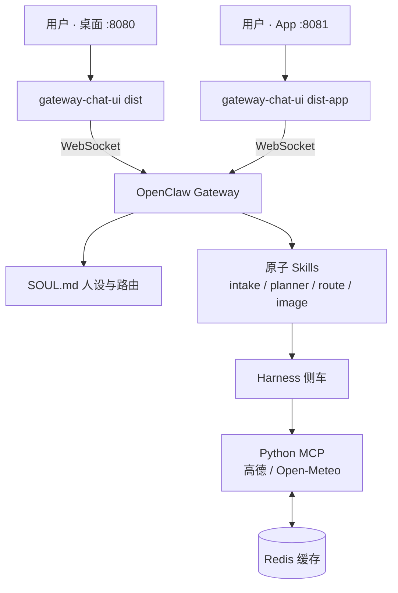

# 现在就出发 — AI 本地路线智能规划管家

> **作品名称**：现在就出发 — AI 本地路线智能规划管家  
> **C 端产品名（App）**：**点评管家** — 你的本地逛吃搭子  
> **赛题**：【赛题5】现在就出发：AI 本地路线智能规划  
> **在线 Demo**：  
> - **桌面评测 Web**：https://121.41.81.58:8080  
> - **移动 App 壳**：https://121.41.81.58:8081  
> **项目周期**：2026.05 - 2026.07  
> **团队成员**：独立开发者  
> **详细 UI 方案**：`ui-redesign/App UI方案.md` · `ui-redesign/UI优化方案.md`

---

## 目录

1. [项目背景与问题定义](#1-项目背景与问题定义)
2. [产品定位与双端交付](#2-产品定位与双端交付)
3. [核心用户旅程 (User Journey Map)](#3-核心用户旅程-user-journey-map)
4. [体验设计：UI + Agent 双层「朋友化」](#4-体验设计ui--agent-双层朋友化)
5. [技术架构详解：为什么选择 OpenClaw](#5-技术架构详解为什么选择-openclaw)
6. [四大核心技术设计](#6-四大核心技术设计)
7. [赛题约束与评审维度深度对齐](#7-赛题约束与评审维度深度对齐)
8. [项目成果与数据](#8-项目成果与数据)
9. [评委查看指南](#9-评委查看指南)

---

## 1. 项目背景与问题定义

### 1.1 行业现状与竞品分析

在本项目立项初期，我们对主流 OTA 平台（飞猪、同程、马蜂窝、途牛）与独立出行应用（问旅、圆周旅迹、小红书「点点」、美团小团）进行了深度测评，发现行业存在以下通病：

| 产品类型 | 响应速度 | 复杂问题分析 | 费用计算 | 多地点规划稳定性 | C 端对话体验 |
|----------|----------|--------------|----------|------------------|--------------|
| **OTA 内置 AI** | ✅ 快 | ⚠️ 一般（偏电商思维） | ✅ 强 | ⚠️ 一般（存在 AI 幻觉） | ⚠️ 像下单工具 |
| **独立应用** | ✅ 快或 ⚠️ 慢 | ❌ 较弱（擅长种草而非规划） | ❌ 弱 | ❌ 较差（质量波动大） | ⚠️ 偏报告体 |
| **对话型助手（点点/小团）** | ✅ 快 | ⚠️ 中等 | ⚠️ 弱 | ⚠️ 不稳定 | ✅ 朋友感强 |

### 1.2 四大核心痛点

1. **响应慢 + 黑盒等待**：用户输入后界面长时间无反馈，不知道是死机还是在思考，超过 5 秒就产生焦虑。
2. **复杂问题分析不全面**：多约束需求（避周一闭馆、赶火车、控制预算）经常被遗漏，时间安排不合理。
3. **费用计算能力弱**：要么高估要么低估，或者 AI 本身调用成本过高不可控。
4. **多地点规划回答质量不稳定**：同一需求每次生成的方案质量波动极大，用户无法预期哪次可靠。

### 1.3 我们的解决思路（一句话）

**用真实 POI 检索 + 算路规划保证「准」，用 Harness 护栏保证「稳」，用聊天气泡内的进度提示 + 朋友化 Agent 语气保证「像人在帮你安排」。**

---

## 2. 产品定位与 App 交付

### 2.1 决赛演示以 App 为主

赛题 C 端心智是 **手机上的对话式规划**。决赛路演 **现场演示 App 壳**（`:8081`），评委用手机或窄屏浏览器即可完整走通旅程。

| 入口 | URL | 路演角色 |
|------|-----|----------|
| **移动 App 壳（主）** | https://121.41.81.58:8081 | **决赛 Demo**：点评管家、POI 卡、进度条、地图 |
| 桌面 Web（辅） | https://121.41.81.58:8080 | 工程师视角、左栏工具明细；**不作为 UI 方案答辩重点** |

**关键原则**：App 与 Web 共享 OpenClaw Gateway + Harness + MCP；App 独立构建产物 `npm run build:app` → `dist-app/`，Nginx 8081 站点。

### 2.2 C 端产品名与品牌

| 层级 | 名称 | 说明 |
|------|------|------|
| 赛题作品名 | 现在就出发 — AI 本地路线智能规划管家 | 答辩 / 文档标题 |
| App 主标题 | **点评管家** | Header Logo + 美团黄 `#ffc300` |
| 可选副标 | 你的本地逛吃搭子 | caption 级，不占主视觉 |
| 模型 | **豆包 Seed 2.0 Lite**（固定） | App 不展示模型选择器 |

### 2.3 App 信息架构（一页流）

```
┌─────────────────────────────┐
│  [评] 点评管家            ≡ │  ← 历史抽屉
├─────────────────────────────┤
│         [用户消息泡]         │  浅黄右对齐
│  [进度提示条 · 单行]         │  ← ThinkingBubble（live，不落库）
│  [Agent 泡]                  │
│    · 选择题 Intake           │
│    · 完整方案（POI 卡+地图）  │
│    · 生图一览                │
│  [猜你想问 chips]            │  ← 完整方案后
├─────────────────────────────┤
│ [ 有什么想调整的？ ] [发送]  │
│ 内容由 AI 生成               │
└─────────────────────────────┘
```

---

## 3. 核心用户旅程 (User Journey Map)

我们以「小陈」为例，走完整 **App（8081）** 流程；下文 UI 描述 **仅指 App 端**。

### 👤 用户角色

- **姓名**：小陈，25 岁，互联网运营  
- **特征**：工作忙、想放松、对价格敏感、习惯用 AI 但讨厌「答非所问」和「报告腔」  
- **目标**：10 分钟内拿到一份可直接照着走的行程  
- **痛点**：信息碎片化、传统 Agent 要么太泛要么遗漏约束、界面像调试控制台  

---

### 阶段一：模糊意图输入（触发与启动）

| 维度 | 内容 |
|------|------|
| **用户行为** | 「我和老伴想在附近玩半天，少台阶少走路」 |
| **产品决策** | **不做强制表单**，任何一句「人话」都可以作为起点 |
| **技术** | 位置上下文与用户首句 **合并为一条 user 消息** 发送（UI 只展示原话，不暴露 `[位置上下文]` 块） |
| **用户感受** | 😐 试探性 |

---

### 阶段二：主动澄清与约束补齐（Intake 选择题）

| 维度 | 内容 |
|------|------|
| **用户行为** | 看到 2～3 道选择题（预算 / 偏好 / 时段），点选 pill 后确认 |
| **产品决策** | **用选择代替输入**；口语补充走底部输入框，发送后问卷置灰 |
| **UI** | 白底 Intake 卡、A/B/C/D pill；**此阶段不显示进度条**（避免与问卷抢注意力） |
| **技术** | `travel-intake` Skill 负责补槽；Harness **Stage A 禁止** search/route 等重工具；SOUL bootstrap 预注入 intake 摘要，**取消 `[系统预热]` 隐藏消息** |
| **用户感受** | 😊 轻松 |

---

### 阶段三：规划生成与过程透明（进度提示 + 工具调用）

| 维度 | 内容 |
|------|------|
| **用户行为** | 提交选择题后，在 **问卷泡下方** 看到单行进度：「🔍 搜罗附近好吃的/好逛的…」→「🔍 正在查申园…」→「🚶 把这几个点给你串成顺路的…」 |
| **产品决策** | **用透明度换取耐心**；进度文案 **朋友化、单行、不换行**；**任意用户消息**（含追问 chip）在正式回复出现前 **必须** 有进度条 |
| **UI** | `ThinkingBubble` 插在触发它的用户泡 / 锁定问卷泡 **正下方**；最短展示约 **750ms**，避免「闪一下就没」；App **不展示** role 标签与左栏 debug |
| **技术** | 前端 `friendlyProgress.ts` 规则映射 WS `toolSteps`（**零额外 LLM**）；`agentReplyPending` 从发送到 `chat.final` 全程为 true |
| **用户感受** | 😌 安心且有期待 |

**进度文案全集（已实现）**：

| 触发时机 | 外显文案 |
|----------|----------|
| 未连接 | 网络重连中，稍等一下… |
| A 阶段等选择题 | 🔍 听听你这趟想要什么… |
| read 加载指引 | 📖 翻翻我的小本本… |
| B 阶段 / 搜 POI | 🔍 搜罗{区域}附近好吃的/好逛的… / 🔍 正在查{关键词}… |
| 查天气 | 🌤 看看{城市}天气咋样… |
| 规划路线 | 🚶 把这几个点给你串成顺路的… |
| 追问调整 | ✍️ 按你说的再改改路线… |
| 流式写方案 | ✍️ 攻略制定中… |
| 行程一览图 | 🎨 给你画张路线一览图… |

---

### 阶段四：分层交付结果（方案 + POI 卡 + 地图 + 生图）

| 维度 | 内容 |
|------|------|
| **用户行为** | 完整方案白底泡流式出现；**每日行程**里每个 POI 以 **横卡** 展示（图 / 评分 / 人均 / 距你）；下方小地图可展开；约 1 分钟后彩色行程一览图异步插入 |
| **产品决策** | **异步分层交付** — 文字优先，图后补；**地点栏与正文去重**（卡片已含跳转高德，正文剥掉重复配图 + amap 链接） |
| **UI 细节** | V1 浅色 token：表头 `#ebebeb`、正文 `#3d3d3d`、链接 `#ff6b00`；Mermaid 动线 **浅色主题**（非桌面深色控制台风） |
| **技术** | `PlanMessageBody` + `planPoiEmbed.ts` 内嵌 `PoiCard`；`session-pois` API + whitelist；`itinerary-image` 异步生图 |
| **用户感受** | 😃 满意 |

**POI 横卡规则摘要**：

- 数据来自 session POI whitelist，**不从 Markdown 正则硬抠**
- 有图才显示缩略图；无评分 / 无人均 / 无距离 → **隐藏该字段**（不显示「待确认」）
- 整卡点击 → 高德 POI 页 `amap_place_url`
- 每日行程区才嵌卡；**行程速览表** 保持纯表格

---

### 阶段五：灵活调整与最终采纳（追问 chips + 局部修改）

| 维度 | 内容 |
|------|------|
| **用户行为** | 点击「猜你想问」：「路线再轻松点」；或自己输入调整句 |
| **产品决策** | chip 点击 = 完整发送链路（用户泡 + 新轮进度条 + Agent 回复）；支持 **手术式修改**，非整篇重写 |
| **UI** | chips 紧挨 **最后一条方案泡下方**；处理中置灰 |
| **技术** | OpenClaw 持久化会话 + SOUL 阶段路由；Harness 约束工具只针对变更涉及 POI；追问轮 `isFollowUpTurn` 驱动进度文案 |
| **用户感受** | 😍 惊喜（Agent「懂」我，界面像朋友而不是工单系统） |

**默认 chips（过渡模板，二期可改 Agent 结构化输出）**：

- 路线再轻松点  
- 附近加一家咖啡  
- 预算再低一点  
- 换几家本地人爱吃的  

---

## 4. 体验设计：UI + Agent 双层「朋友化」

> **核心判断**：工具感来自 **两层叠加** — Agent 写得像报告 + UI 长得像控制台。只改 UI 或只改提示词都不够，必须 **双层同步**。

### 4.1 设计原则（V1 Light + 美团黄）

Design Tokens 见 `ui-redesign/UI优化方案.md` §4.1：

| Token | 值 | 用途 |
|-------|-----|------|
| `--brand` | `#ffc300` | Logo、发送钮、进度条点缀 |
| `--bubble-user` | `#fff8e1` | 用户泡 |
| `--bubble-assistant` | `#ffffff` | 方案泡 |
| `--ink` / `--body` | `#1a1a1a` / `#3d3d3d` | 标题 / 正文 |
| `--accent` | `#ff6b00` | 链接、评分强调 |
| `--map-route` | `#34c759` | 路线绿 |

**禁止在 App 方案泡内使用桌面深色 Markdown 主题**（黑底表头、dark Mermaid），已用 `markdown-body--app-light` 覆盖。

### 4.2 UI 层：从控制台到聊天

| 工具感 ❌ | 朋友感 ✅（已实现 / 规划） |
|----------|---------------------------|
| 底部「任务进展 · 4/5 步」 | 聊天气泡内 **单行**「🔍 正在查…」 |
| 「已完成分析 ›」 | 「想好啦，你看看这版」或弱化为进度条 |
| 左栏 debug 角色标签 user/assistant | **禁止** 在 App 展示 role 标签 |
| POI 正文重复大图 + 高德链接 | **仅保留地点栏**，正文自动剥重 |
| 页面 + 聊天区双滚动条闪动 | 外层 `overflow: hidden`，仅 `.stream` 内滚动 |
| placeholder「按住说话」 | 「有什么想调整的？」+ 实心 **发送** |
| 模型下拉 | App **固定** Seed 2.0 Lite，不展示 |

### 4.3 Agent 层：`SOUL.md` 与朋友化提示词

人格与路由仍由 **`workspace/SOUL.md`** 定义（部署至 ECS `~/.openclaw/workspace`）。**阶段路由、Harness 门禁、工具调用规则不动**；迭代集中在 **语气层 + 输出形态**。

#### 4.3.1 称呼与语气（写入 SOUL 人格段）

```
- 称呼：用「你」「咱们」，不用「用户」「为您」。
- 完整方案：先 1～2 句口语总评（如「周六人不少，我按轻松节奏排的」），再 POI / 时间表；
  避免一上来就 ## 大标题堆满屏幕。
- 正常答疑 / 追问：短答，不重复贴整张行程表（已有 SOUL 大阶段二规则）。
- 禁止：客服腔（「您好，已为您查询」）、说明书腔（「请点击下方按钮」）、
  在正文输出 user/assistant/live 等角色标签。
```

#### 4.3.2 输出形态与 Markdown 约定

| 场景 | Agent 应做 | 前端如何处理 |
|------|------------|--------------|
| 完整方案 | 行程速览表 + 分时段详细安排 + Mermaid 动线 + 预算表 | 浅色表格 / 浅色 Mermaid；每日 POI 名 → 内嵌横卡 |
| POI 引用 | 可输出 `[店名](amap url)` 或 `[](url)` | 嵌卡时吞掉 `[` / `](url)`，避免残片链接 |
| 追问 chips（二期） | 正文末 `<!-- chips: ["...", "..."] -->` | 前端解析替换默认 chips |
| 首响 | 允许一句短 ack，但 **B 阶段 ack 不进对话区**（仅进展区 / 进度条） | `shouldSkipEarlyFlushAckForPlanPhase` |

#### 4.3.3 Bootstrap 与阶段优化（已实施）

| 优化项 | 目的 | 状态 |
|--------|------|------|
| 删除 `[系统预热]` 隐藏消息 | 减少 Send 后空等 15～17s | ✅ |
| SOUL 内嵌 **travel-intake 执行摘要** | A 阶段不再 read 三个文件 | ✅ |
| A 阶段禁止 `read`/`glob` SOUL、travel-intake | 首响从 ~3 轮 LLM 降到 ~1 轮 | ✅ |
| 位置与用户首句 **合并一条 user** | 减少一轮往返；UI 不暴露位置块 | ✅ |
| App Gateway `allowedOrigins` 含 `:8081` | 移动端 WSS 握手 | ✅ |

#### 4.3.4 思考泡 vs 正式回复的分工

| 内容 | 谁负责 | 是否落库 |
|------|--------|----------|
| 「🔍 正在查故宫…」等进度 | 前端 `friendlyProgress.ts` | ❌ live |
| 正式方案 / 答疑 / 选择题 | Agent + SOUL 路由 | ✅ history |
| 左栏 tool step 明细 | WS 事件 → `toolSteps` | App 不展示（Web 8080 可见，供开发调试） |

**不采用双 LLM** 写思考文案：成本翻倍且难同步；规则模板 + 用户关键词槽位足够。

### 4.4 关键前端模块（8081）

| 模块 | 路径 | 职责 |
|------|------|------|
| App 壳入口 | `main-app.tsx` + `vite.app.config.ts` | 仅加载 `app-shell.css` + tokens |
| 进度提示 | `ThinkingBubble.tsx` + `friendlyProgress.ts` | 单行朋友化进度 |
| 方案渲染 | `PlanMessageBody.tsx` + `planPoiEmbed.ts` | 分段 + POI 内嵌 + 链接去重 |
| POI 横卡 | `PoiCard.tsx` + `geo/distance.ts` | 评分 / 人均 / 距你 |
| 路线地图 | `RouteMap.tsx` | 高德 JS 小地图 + 展开 |
| 追问 | `FollowUpChips.tsx` | 猜你想问 → `sendUserText` |
| 历史 | `HistoryDrawer.tsx` | ≡ 右侧抽屉 |

---

## 5. 技术架构详解：为什么选择 OpenClaw

### 5.1 OpenClaw 与传统 Agent 的本质区别

| 维度 | 传统 Agent | OpenClaw |
|------|-----------|----------|
| **会话管理** | 与单次请求/连接绑定，服务器重启即丢失 | **系统层基础设施**，持久化、独立于连接 |
| **弹性伸缩** | 需「粘性会话」，扩容痛苦 | **无状态 Worker + 中央状态池** |
| **跨渠道** | 单租户单渠道 | **全局用户映射**，Web / App 同 session |

### 5.2 本项目的 OpenClaw 架构图



### 5.3 基于 ReAct 的 Agent Loop

1. **Think**：模型根据 SOUL、历史、工具结果决定下一步  
2. **Act**：调用 MCP（搜点 / 算路 / 查天气）  
3. **Observe**：观察返回或 Harness 拦截  
4. **Loop**：直至任务完成  

Agent **不是固定脚本**，而是根据实时 POI 数据动态调整。

---

## 6. 四大核心技术设计

### 6.1 Skill 编排：四个原子 Skill 各司其职

1. **travel-intake**：意图采集与补槽，生成 A/B/C/D 选择题  
2. **local-itinerary-planner**：核心规划，表格 + Mermaid + 分时段长文  
3. **route-and-mobility**：高德算路，步行/驾车段距  
4. **mock-user-prefs-reviews**：偏好加权（点评语料模拟）  

### 6.2 Redis 智能缓存

- **对象**：高德 POI（TTL 10min）、Open-Meteo（TTL 1d）  
- **降级**：Redis 不可达时自动无缓存模式，服务不中断  
- **键**：SHA256 参数哈希，避免冲突  

### 6.3 Harness Engineering

- **Pre-Tool Guard**：Stage A 禁止 search/route；参数校验  
- **Post-Output Repair**：Markdown/Mermaid 修复；免责与预约提示注入  
- **YAML 策略**：显式能力边界（支持规划、不支持订票）  

#### 6.3.1 深度批测方案（6.3 自动化测评）

> 文档：`已修复/模型选型评测/6.3方案/6.3测评流程.md` · 借鉴美团 VitaBench 论文的 Orchestrator 思路，在本项目 **真实网关 + 高德/天气 MCP** 上落地。

**要测什么**：在 **冻结 Agent 人设与考卷** 的前提下，让候选大模型轮流当「大脑」，在同一套任务上自动答题、自动打分，用于 **迭代 Harness / SOUL** 与 **单模型深测**（本批以 **Qwen 系列** 为主跑通流水线）。

**三 LLM 协同 Orchestrator 循环**：

```text
用户模拟器 LLM ──► Agent LLM ──► 环境（Skill + MCP 工具）
       ▲                │
       └──── 对话 ──────┘
对话结束后 → 滑动窗口裁判 LLM 按 rubric 逐条打分
```

| 组件 | 输入 | 职责 |
|------|------|------|
| 用户模拟器 | 用户画像 + 任务指令 + 历史 | 按画像逐步提需求，检查是否满足后 stop |
| Agent | SOUL + 工具结果 | 补槽、搜点、算路、出方案 |
| 环境 | tool_calls | Open-Meteo、高德 POI/算路；错误计入 num_errors |
| 裁判 | 完整轨迹 + evaluation_criteria | `state_rubrics` + `overall_rubrics` 滑动窗口达标 |

**考卷设计**：从 ChinaTravel / Cultour / 804 攻略语料改写，**50 条任务**（难度约 3:5:2）；每条含 `user_scenario`、`instructions`、`evaluation_criteria`（须调天气、须搜 POI、预算符合等）。

**与 11×3 人工横向的关系**：

- **6.3 批测**：题量大、全自动、适合 **单模型深测与回归**；本仓库已用其验证 Qwen 等模型的 rubric 通过率与失败类型分布。  
- **11×3 人工横向**（见 §6.4.2）：11 个模型各跑 3 道代表题，**人工走查 App + session 自动 rubric**，用于 **选型决策**。  
- **现网默认模型 = 豆包 Seed 2.0 Lite**，来自 11×3 横向 **综合分第一**，**不是**仅由 6.3 Qwen 深测得出。

### 6.4 评测闭环与模型选型

评测分 **三层**，形成「选型 → 深测 → 迭代 → 回归」闭环：

```text
┌─────────────────────────────────────────────────────────────┐
│  A. 11 模型 × 3 任务 · 人工横向（2026-06）→ 选定 Seed Lite   │
└──────────────────────────────┬──────────────────────────────┘
                               ▼
┌─────────────────────────────────────────────────────────────┐
│  B. 6.3 自动化批测（50 题 + 滑动窗口 rubric）→ Qwen 等深测   │
└──────────────────────────────┬──────────────────────────────┘
                               ▼
┌─────────────────────────────────────────────────────────────┐
│  C. Harness / SOUL 迭代 → 冒烟卷回归 → 指标提升（见下表）    │
└─────────────────────────────────────────────────────────────┘
```

#### 6.4.1 评测指标（统一口径）

| 指标 | 含义 |
|------|------|
| **Mean Rubric Reward** | 每条 rubric（须调天气、须搜 POI…）达标比例，对有效任务取平均 |
| **Full Success Rate** | rubric **全部达标**的任务占比 |
| **工具精准率** | 工具调用是否符合阶段门禁与参数约束 |
| **首 Token 响应** | 用户发消息后 Agent 出第一个字的时间（赛题 <10s） |

#### 6.4.2 11 模型 × 3 任务 · 人工横向评测（选型依据）

> 完整报告：`11模型Agent横向评测报告_2026-06-24.md`  
> 数据：`eval_manual_2026-06-24.jsonl` + 补测 `eval_manual_2026-06-25.jsonl`

**设定**：每模型 3 道代表任务 — **T063_002（简单）** / **T063_034（中等）** / **T063_048（困难）**；在 **真实 App + OpenClaw** 上人工走查，session 日志自动 rubric 计分；**每难度取最后一轮有效 session**。

**综合分公式**：55% Mean Reward×完成度 + 22.5% 三档平均 intake 首字 + 22.5% 三档平均任务总时长（首字≤10s、总时长≤90s 满分）− 工具降级惩罚。

**总览排名（节选）**：

| 排名 | 模型 | 有效计分 | Mean Reward | Full Success | 平均首字 | 平均总时长 | 综合分 | 结论 |
|------|------|----------|-------------|--------------|----------|------------|--------|------|
| **1** | **豆包 Seed 2.0 Lite** | 3/3 | **96.3%** | 2/3 | 15.7s | 83.0s | **0.94** | ✅ **现网默认** |
| 2 | DeepSeek V4 Flash | 3/3 | 95.8% | 2/3 | 19.5s | 61.4s | 0.88 | 质量+速度备选 |
| 3 | 豆包 Seed 2.0 Code | 3/3 | 70.4% | 2/3 | 24.7s | 93.9s | 0.74 | 困难任务不稳 |
| 4 | 豆包 Seed 2.0 Pro | 2/3 | 100.0% | 2/3 | 22.8s | 55.9s | 0.73 | 话术好，部分任务缺计分 |
| 5 | Kimi K2.6 | 3/3 | 87.5% | 1/3 | 38.2s | 40.3s | 0.71 | 首响偏慢 |
| 6 | GLM-4.7 | 3/3 | 62.5% | 1/3 | 19.0s | 64.6s | 0.70 | 中等任务易空答 |
| 7 | DeepSeek V4 Pro | 3/3 | 79.2% | 2/3 | 29.2s | 160.8s | 0.69 | 总时长偏长 |
| 8 | MiniMax M2.7 | 3/3 | 62.5% | 1/3 | 28.0s | 83.9s | 0.68 | 流式偏慢 |
| 9 | MiniMax M3 | 3/3 | 52.3% | 0/3 | 33.7s | 82.4s | 0.55 | 不推荐 |
| 10 | 豆包 Seed Code | 2/3 | 18.8% | 0/3 | — | — | 0.18 | 难以完成 |
| 11 | Kimi K2.7 Code | 1/3 | 0.0% | 0/3 | — | — | 0.07 | 未测完 |

**选型结论**：

1. **Seed 2.0 Lite**：综合分 **0.94**，Mean Reward **96.3%**，三档任务均可计分 → **App 固定默认模型**。  
2. **DeepSeek V4 Flash**：综合分 0.88，Mean Reward 95.8%，总时长更短 → 费用/速度敏感场景备选。  
3. Code 系 / MiniMax M3 / Kimi K2.7 Code：困难任务或 Full Success 明显不足 → 不进入现网。

#### 6.4.3 6.3 自动化批测迭代成果（Harness 回归）

在 Seed Lite 定稿后，用 §6.3.1 流水线对 **Qwen 等模型** 做 50 题深测，并驱动 Harness / SOUL 迭代：

| 指标 | 迭代前 | 迭代后 | 说明 |
|------|--------|--------|------|
| 任务成功率（Full Success） | 82% | **90%** | 50 题 rubric 批测 |
| 工具调用精准率 | 66% | **95%** | Pre-Tool Guard + SOUL 阶段路由 |
| 首 Token 响应 | ~10s | **<5s** | bootstrap 预注入 + 位置合并 + A 阶段禁重工具 |

**答辩表述建议**：「选型看 11 模型横向表；深测与迭代看 6.3 自动化批测；现网大脑是横向第一的 Seed Lite。」

### 6.5 记忆机制

- **会话级**：OpenClaw 网关维护多轮上下文  
- **静态画像**：`MEMORY.md` 偏好种子  
- **增量修改**：追问时基于已有方案局部更新  

---

## 7. 赛题约束与评审维度深度对齐

### 7.1 硬性约束

| 约束 | 实现 |
|------|------|
| 首 Token < 10s | Stage A/B 拆分；bootstrap 预注入；位置合并；实际常 <5s |
| POI 餐饮 + 文化 | Skill 强制双类型搜索 + Harness 后校验 |
| ≥3 POI 串联 | 半天 ≥3 锚点 + 1 餐；相邻点必算路 |

### 7.2 完整性

- POI 经纬度 / 地址来自高德，拒绝脑补  
- SOUL 要求预留吃饭 / 赶车时间  
- 冲突需求 explicit trade-off  

### 7.3 创新性

**体验创新（App 端，2026-07）**：

- **点评管家 C 端壳**：8081 单列对话，美团黄 + 浅色方案泡  
- **聊天气泡内进度提示**：替代底部 timeline，朋友化单行  
- **POI 横卡内嵌 + 正文去重**：小团式富卡 + 点点式地图  
- **UI + SOUL 双层朋友化**：不只改皮，也改语气与输出形态  
- **异步分层交付**：文字流式 → 生图 → 地图  

**技术创新**（保持）：

- LLM 决策 + 真实检索 + 算路  
- 单 Agent + 原子 Skill  
- Harness Pre/Post 双重保险  

### 7.4 应用效果

- 代码分层：UI / Gateway / MCP / Harness / 评测  
- Docker Compose + ECS 部署脚本（`deploy_app_to_ecs.py`、nginx 8081）  
- 文档：`产品设计思路.md`（本文）、`App UI方案.md`、开发与部署说明  

---

## 8. 项目成果与数据

| 指标 | 迭代前 | 迭代后 | 备注 |
|------|--------|--------|------|
| 任务成功率 | 82% | 90% | rubric 评测 |
| 工具调用精准率 | 66% | 95% | Harness + SOUL |
| 首 Token | ~10s | <5s | bootstrap + 位置合并 |
| POI 双类型覆盖 | 70% | 100% | 赛题硬约束 |
| **C 端 App 壳** | — | **已上线 :8081** | 2026-07 |

---

## 9. 评委查看指南

### 9.1 快速体验（推荐顺序 · App 为主）

1. **手机或窄屏** 打开 **App**：https://121.41.81.58:8081  
   - 首句：「我和老伴想在附近玩半天，少台阶少走路」  
   - 观察：**进度条** → 选择题 → 提交后 **搜点进度** → 方案 **POI 卡** → **猜你想问**  
2. 自签 HTTPS：首次访问点「高级 → 继续访问」  
3. （可选）桌面 https://121.41.81.58:8080 查看左栏工具明细，**非决赛 UI 答辩重点**

### 9.2 建议验证点

| # | 验证项 | 预期 |
|---|--------|------|
| 1 | 任意发送消息后、正式回复前 | 必有 **单行进度提示**（≥约 0.75s） |
| 2 | 完整方案 · 每日行程 | POI **横卡**；无重复 amap 链接 / 大图 |
| 3 | 动线可视化 / 预算表 | **浅色**可读，非黑底灰字 |
| 4 | 点击 chip「路线再轻松点」 | 用户泡 + 新进度 + 修订方案 |
| 5 | POI 卡点击 | 跳转高德 POI 页 |
| 6 | GitHub + 本文档 | 代码与方案设计可复现 |

### 9.3 深度阅读

| 文档 | 内容 |
|------|------|
| 本文 | 产品思路、旅程、朋友化双层、架构 |
| `ui-redesign/App UI方案.md` | App UI 细则、进度条、POI、部署清单 |
| `ui-redesign/UI优化方案.md` | Design Tokens、Web 改版方向 |
| `docs/开发与部署说明.md` | 构建与 ECS |
| `docs/线上Agent-Harness约束方案.md` | Harness 策略 |
| `workspace/SOUL.md`（ECS） | Agent 人格、阶段路由、语气规范 |
| `11模型Agent横向评测报告_2026-06-24.md` | 11×3 人工横向总览表与选型结论 |
| `已修复/模型选型评测/6.3方案/6.3测评流程.md` | 6.3 自动化批测 Orchestrator |

### 9.4 构建与部署命令（供复现）

```bash
# 桌面 Web
cd gateway-chat-ui && npm run build
# 移动 App
cd gateway-chat-ui && npm run build:app
# App 部署 ECS :8081
python gateway-chat-ui/scripts/deploy_app_to_ecs.py
```

---

*文档版本：2026-07-01 · App UI（8081）+ 11×3 选型 + 6.3 批测闭环*
