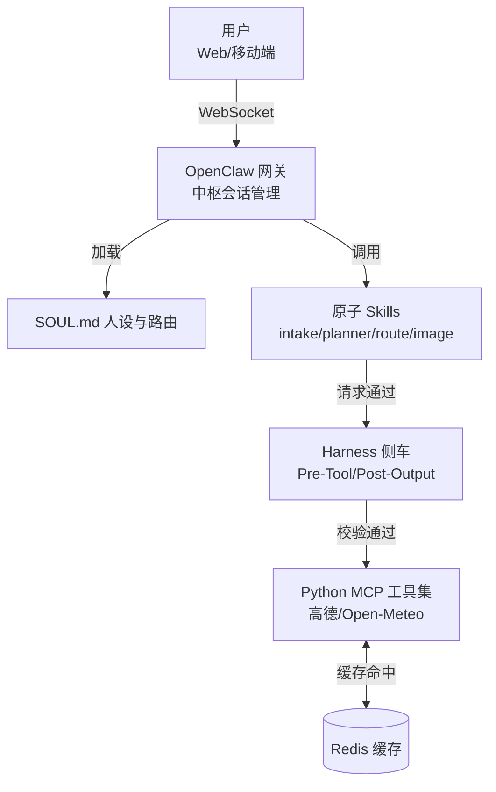

# 现在就出发 — AI 本地路线智能规划管家

> **作品名称**：现在就出发 — AI 本地路线智能规划管家  
> **赛题**：【赛题5】现在就出发：AI 本地路线智能规划  
> **在线 Demo**：https://121.41.81.58:8080  
> **项目周期**：2026.05 - 2026.06  
> **团队成员**：独立开发者

---

## 目录
1. [项目背景与问题定义](#1-项目背景与问题定义)
2. [核心用户旅程 (User Journey Map)](#2-核心用户旅程-user-journey-map)
3. [技术架构详解：为什么选择 OpenClaw](#3-技术架构详解为什么选择-openclaw)
4. [四大核心技术设计](#4-四大核心技术设计)
5. [赛题约束与评审维度深度对齐](#5-赛题约束与评审维度深度对齐)
6. [项目成果与数据](#6-项目成果与数据)
7. [评委查看指南](#7-评委查看指南)

---

## 1. 项目背景与问题定义

### 1.1 行业现状与竞品分析
在本项目立项初期，我们对主流OTA平台（飞猪、同程、马蜂窝、途牛）与独立出行应用（问旅、圆周旅迹、小红书“点点”）进行了深度测评，发现行业存在以下通病：

| 产品类型 | 响应速度 | 复杂问题分析 | 费用计算 | 多地点规划稳定性 |
|----------|----------|--------------|----------|----------------|
| **OTA内置AI** | ✅ 快 | ⚠️ 一般（偏电商思维） | ✅ 强 | ⚠️ 一般（存在AI幻觉） |
| **独立应用** | ✅ 快或⚠️ 慢 | ❌ 较弱（擅长种草而非规划） | ❌ 弱 | ❌ 较差（质量波动大） |

### 1.2 四大核心痛点
基于竞品分析，我们定义了本项目要攻克的四大痛点：

1. **响应慢**：用户输入后界面“黑盒等待”，不知道是死机还是在思考，超过5秒就产生焦虑。
2. **复杂问题分析不全面**：多约束需求（如“避周一闭馆、赶火车、控制预算”）经常被遗漏，时间安排不合理。
3. **费用计算能力弱**：要么高估要么低估，或者AI本身调用成本过高不可控。
4. **多地点规划回答质量不稳定**：同一需求每次生成的方案质量波动极大，用户无法预期哪次可靠。

---

## 2. 核心用户旅程 (User Journey Map)

我们以“小陈”为例，完整走一遍产品流程：

### 👤 用户角色
- **姓名**：小陈，25岁，互联网运营
- **特征**：工作忙、想放松、对价格敏感、习惯用AI但讨厌“答非所问”
- **目标**：10分钟内拿到一份可直接照着走的行程
- **痛点**：信息碎片化、传统Agent要么太泛要么遗漏约束

---

### 阶段一：模糊意图输入（触发与启动）
- **用户行为**：“我想五一去成都玩两天，大概什么路线？”
- **产品决策**：**不做强制表单**，任何一句“人话”都可以作为起点。
- **用户感受**：😐 试探性（不知道能不能懂我）

---

### 阶段二：主动澄清与约束补齐（澄清与信息收集）
- **用户行为**：弹出2道选择题（预算/偏好），点选后确认。
- **产品决策**：**用选择代替输入**，把复杂问题拆成轻量级选择题，降低交互成本。
- **技术实现**：`travel-intake` Skill 专门负责意图识别与补槽；Harness 预拦截确保此时不调用重资源接口。
- **用户感受**：😊 轻松（比想象中简单）

---

### 阶段三：规划生成与过程透明（等待与处理）
- **用户行为**：看到动态进度提示：“搜成都热门景点”→“规划最优路线”→“生成行程图”，约4秒后文字开始逐字出现。
- **产品决策**：**用透明度换取耐心**，拆解思考过程成可展示的步骤，让用户看到“事情在推进”，就像Uber打车时显示“司机正在赶来”。
- **技术实现**：左栏任务进展实时刷新，右栏流式文本同步渲染。
- **用户感受**：😌 安心且有期待

---

### 阶段四：分层交付结果（结果呈现）
- **用户行为**：先看到文字攻略逐字流出，约2秒后，彩色行程图异步出现。
- **产品决策**：**异步分层交付**——优先流式输出文字（第一时间给干货），后台异步生图。文字负责深度，图片负责概览。
- **技术实现**：`local-itinerary-planner` Skill 生成结构化长文；`itinerary-image` 服务异步处理生图请求。
- **用户感受**：😃 满意（超出预期）

---

### 阶段五：灵活调整与最终采纳（迭代与闭环）
- **用户行为**：“第二天下午的熊猫基地换成博物馆吧。”
- **产品决策**：**局部修改能力**——基于已输出的结构化方案做手术式调整，只改涉及部分，保留未涉及部分。
- **技术实现**：OpenClaw 持久化会话状态 + `SOUL.md` 路由控制；Harness 确保工具调用只针对修改部分。
- **用户感受**：😍 惊喜（没有全部重来，感觉Agent“懂”我）

---

## 3. 技术架构详解：为什么选择 OpenClaw

### 3.1 OpenClaw 与传统 Agent 的本质区别
| 维度 | 传统 Agent | OpenClaw |
|------|-----------|----------|
| **会话管理** | 与单次请求/连接绑定，服务器重启即丢失 | **系统层基础设施**，持久化、独立于连接，7x24小时不间断 |
| **弹性伸缩** | 需“粘性会话”，扩容痛苦 | **无状态 Worker + 中央状态池**，原生水平伸缩，流量暴增时秒级拉起 |
| **跨渠道** | 单租户单渠道，数据隔离 | **全局用户映射表**，跨设备无缝衔接 |

### 3.2 本项目的 OpenClaw 架构图

### 3.3 基于 ReAct 的 Agent Loop
我们采用 OpenClaw 内置的 ReAct 循环实现真正的自主决策：
1. **Think**：模型根据 SOUL.md、对话历史、工具结果决定下一步
2. **Act**：自主调用 MCP 工具（搜点/算路/查天气）
3. **Observe**：观察工具返回结果（或 Harness 拦截错误）
4. **Loop**：重复直至任务完成

这种设计的关键在于：**Agent 不是执行固定脚本，而是根据实时数据动态调整**。

---

## 4. 四大核心技术设计

### 4.1 Skill 编排：四个原子 Skill 各司其职
我们没有使用复杂的 Multi-Agent 协作，而是通过**单 Agent + 原子 Skill 编排**实现了功能解耦：

1. **travel-intake**：意图采集与补槽，生成带 A/B/C/D 的选择题
2. **local-itinerary-planner**：核心规划，基于搜点结果生成带表格与 Mermaid 的长文方案
3. **route-and-mobility**：交通计算，两点间高德算路，预留赶车时间
4. **mock-user-prefs-reviews**：个性化偏好加权，模拟点评语料

### 4.2 Redis 智能缓存：自动降级，稳定性优先
为了提升响应速度并降低外部 API 调用成本，我们设计了智能缓存层：
- **缓存对象**：高德 POI 搜索（TTL 10分钟）、Open-Meteo 天气/地理编码（TTL 1天）
- **自动降级机制**：如果 Redis 未启动或不可达，工具自动降级为无缓存模式，**不会让整个服务失败**
- **哈希键设计**：使用 SHA256 哈希参数生成唯一缓存键，避免键冲突
- **缓存封装**：`cache_redis.py` 统一管理缓存存取，带异常处理

### 4.3 Harness Engineering：工业级能力护栏
自研 Harness 侧车系统，确保 Agent “守规矩”：
- **Pre-Tool Guard**：状态机感知的工具门禁
  - 补槽阶段（Stage A）禁止搜点/算路，只返回拦截 JSON
  - 参数合法性校验（关键词不能为空、经纬度格式）
- **Post-Output Repair**：自动修复与免责注入
  - 格式修复，确保 Markdown/Mermaid 100% 渲染
  - 自动追加模拟数据/预算估算/热门场馆预约提示
- **YAML 策略文件**：显式定义能力边界（支持规划、不支持订票）

### 4.4 评测闭环：从 82% 到 90% 的迭代
我们搭建了完整的量化评测体系，实现了可复现、可对比的 Agent 质量评估：

#### 评测架构：三 LLM 协同 + 全链路仿真
我们采用了业界标准的评测框架，核心是**三个 LLM 各司其职，全程隔离**：
- **被测 Agent LLM**：运行在与线上 Demo 完全一致的环境中，确保测的就是真实交付的东西
- **用户模拟 LLM**：扮演用户角色，先只透露部分需求，根据 Agent 表现决定是否补充/纠正/结束
- **打分 LLM**：第三方客观裁判，基于对话轨迹和 rubric 逐条打分

评测流程采用**Orchestrator 三步循环**（User ↔ Agent ↔ Env），配置：
- 最大步数 100 步
- 最大错误容忍 10 次
- 遇到 `###STOP###` 标记正常终止
- 提前终止（步满/错满/无效消息）直接给 reward=0

#### 测试集设计：真实场景 + 复杂约束
我们从多个公开基准中筛选并改写了 50 条任务，确保数据的真实性和覆盖度：

**数据来源包括：**
1. **ChinaTravel Benchmark**：HuggingFace 开源的中文旅行任务集，提供了真实用户需求的结构
2. **Cultour 知识库**：结构化景点知识与攻略数据
3. **804 条旅游攻略语料**：覆盖热门城市的深度行程建议
4. **352 城景点基础信息**：POI 名称、类型、评分等元数据

在此基础上，我们进行了场景化改写和难度标注，最终形成：
- **难度分布**：Easy 15 条 / Medium 25 条 / Hard 10 条
- **场景覆盖**：周边半日游、城市一日游、多约束亲子游、突发天气变更、高铁中转站规划、特殊人群（老人/儿童/轮椅）等
- **任务结构**：每条任务包含：
  - 环境信息（时间、位置、历史行为）
  - 用户画像（偏好、禁忌）
  - 分步指令（对 Agent 保密，只给用户模拟器）
  - 详细 rubric（打分点）

#### 滑动窗口打分：可追溯、可解释
为了避免长对话漏评，我们使用**滑动窗口评估法**：
1. 初始化 rubric 状态列表，所有检查点默认为 false
2. 把对话历史切分为窗口（窗口大小 10 条，重叠 2 条）
3. 对每个窗口调用打分 LLM，更新 rubric 的 meetExpectation 状态
4. 最终 Reward = 满足的检查点数量 / 总检查点数量

每条任务还会持久化 `eval_detail.json`，包含 rubric 状态和每条的 justification，支持人工抽检和 bad case 归因。

#### 北极星指标与迭代闭环
我们定义了清晰的评估指标，并建立了完整的迭代流程：

**评估指标体系：**
- **Mean Rubric Reward**：所有任务 reward 的均值（核心指标）
- **Full Success Rate**：reward==1.0 的任务占比
- **First Response Pass**：首 Token 响应速度和首句话质量达标率
- **工具调用精准率**：实际用到的正确工具数 / 总调用数
- **成本指标**：token、工具调用次数、耗时 P95

**实际迭代过程：**
我们采用了**双模型评测与对比迭代**策略：
1. **同时评测两个候选模型**：轻量模型（豆包 Mini）和强模型（Qwen 3.6 Plus）
2. **分开设计评分体系**：
   - 轻量模型：0-100分制规则引擎（首响15%、补槽15%、工具25%、方案完整20%等）
   - 强模型：0-1 rubric命中率（滑动窗口裁判只看任务是否满足）
3. **严格筛选高分轨迹**：
   - 轻量模型：≥80分且为完整方案长文
   - 强模型：reward≥0.8且无agent_error
4. **迭代流程严格执行：**
   1. 批量跑测 → 生成 HTML 报告
   2. 筛选 reward 低的任务 → 拆解 bad case（推理/工具/交互错误）
   3. 针对性迭代提示词、Skill、Harness
   4. 再次跑测，验证提升幅度

**迭代成果数据：**
通过这套闭环，我们实现了显著提升：
- 任务成功率：从 82% → 90%
- 工具调用精准率：从 66% → 95%
- 首 Token 响应速度：平均 <5s
- 完整方案生成时间：平均 2-3min

### 4.6 记忆机制：会话历史 + 静态用户画像
- **会话级记忆**：OpenClaw 网关自动维护同一会话内的多轮上下文
- **静态用户画像**：`MEMORY.md` 中存放用户偏好与点评种子，作为 LLM 软提示注入
- **上下文感知**：用户改约束时，基于历史方案增量更新，而非重跑全流程

---

## 5. 赛题约束与评审维度深度对齐

### 5.1 硬性约束：三大必达指标
我们逐一对照赛题要求，用技术手段确保 100% 满足：

#### 🚀 首 Token 生成响应时间 < 10s
- **两阶段拆分**：Stage A（补槽）只调用轻量 Skill，Stage B（出方案）才调重工具
- **Workspace 预热**：用户打开页面时，后台隐藏触发一次 Agent 预热，加载 SOUL.md 与 Skills
- **前端早刷**：SOUL.md 要求模型先写一句“正在查天气并搜点…”，然后 flush 流式输出
- **实际表现**：单 Agent 平均响应时间从 10s 优化到 5s 内

#### 🍔 POI 类型至少覆盖「餐饮 + 娱乐/文化」
- **强制搜索策略**：`local-itinerary-planner` Skill 中硬约束，必须分别搜索至少两类 POI
- **Harness 后校验**：Post-Output 阶段检查方案里是否同时包含两类，否则触发重规划
- **高德 API**：通过 type 参数分别拉取餐饮（050000）与景点/文化（110000/140000）

#### 📍 单条路线至少支持 ≥3 个 POI 点位串联
- **算法硬约束**：Skill 规定半天行程至少 3 个锚点 + 1 餐，一天至少 5 个锚点
- **闭环设计**：所有路线都“从哪来回哪去”（或回大交通枢纽），确保用户能完整走完
- **两点间必算路**：每两个相邻 POI 都通过高德算路 API 计算真实物理距离与时间

---

### 5.2 评审维度一：完整性
- **路线真实可用**：所有 POI 经纬度、地址、时间均来自高德 API，拒绝“脑补”
- **时间安排合理**：SOUL.md 要求预留赶车/吃饭时间，Harness 检查行程时长不超过用户输入
- **多约束处理**：从 bad case 迭代出的 50 条 rubric 规则，覆盖预算/交通方式/天气/闭馆等
- **冲突处理**：当用户需求冲突时（如“既想省钱又想吃黑珍珠”），明确说明 trade-off

---

### 5.3 评审维度二：创新性
#### 体验创新
- **双栏式沉浸交互**：左栏任务进展（透明化思考），右栏对话主场（结构化呈现）
- **实时自然语言调整**：支持自然语言局部修改，不用重新填表单
- **异步分层交付**：文字优先流式输出，图片后台异步推送
- **卡片化补槽**：将枯燥选择题转化为可点选 Pill，降低输入摩擦

#### 技术创新
- **LLM + 检索规划融合**：不是纯 LLM 推理，而是 LLM 决策 + 真实 POI 检索 + 算路规划
- **单 Agent + 原子 Skill 编排**：比 Multi-Agent 更稳定，延迟更低
- **Harness Engineering 约束系统**：YAML 策略驱动，Pre-Tool 拦截 + Post-Output 修复双重保险

---

### 5.4 评审维度三：应用效果
- **代码结构**：清晰分层（UI/网关/MCP/Harness/评测），模块化设计
- **部署便捷性**：提供完整 Docker Compose + ECS 部署脚本
- **文档完整度**：从产品设计到开发部署到答辩指南全覆盖
- **工程实践**：Redis 缓存、异步生图、会话持久化、评测闭环，体现生产级工程思维

---

## 6. 项目成果与数据

| 指标 | 迭代前 | 迭代后 | 提升幅度 |
|------|--------|--------|----------|
| **任务成功率** | 82% | 90% | +8% |
| **工具调用精准率** | 66% | 95% | +29% |
| **单 Agent 平均响应时间** | 10s | <5s | 缩短一半 |
| **POI 双类型覆盖率** | 70% | 100% | 全达标 |

---

## 7. 评委查看指南

### 快速体验
- **在线 Demo**：访问 https://121.41.81.58:8080
- **访问说明**：自签 HTTPS 证书，首次请点击「高级→继续访问」

### 深度查看
- **产品设计与答辩**：本文档
- **开发与部署**：`docs/开发与部署说明.md`
- **量化测评报告**：浏览器直接打开 `测试/模型选型/results/v63-batch/qwen/qwen_6.3_测评报告.html`
- **Harness 约束方案**：`docs/线上Agent-Harness约束方案.md`
