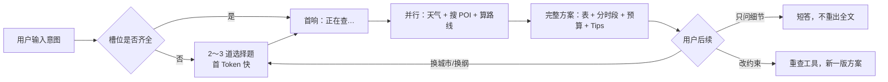

# 赛题5 · 产品设计思路

> **作品名称**：现在就出发 — AI 本地路线智能规划管家  
> **赛题**：【赛题5】现在就出发：AI 本地路线智能规划  
> **在线 Demo**：https://121.41.81.58:8080  
> **访问说明**：Demo 部署在阿里云 ECS，使用 **IP 地址 + 自签 HTTPS 证书**。浏览器首次打开可能提示「连接不安全 / 有风险」，属正常现象，请点击 **「高级」→「继续访问」**（或 Chrome 的「Proceed to…」）即可正常使用，不影响功能体验。

---

## 1. 本项目要解决什么问题

用户在出行或周末游玩时，往往要把「去哪玩、去哪吃、怎么串、时间怎么排」一次性想清楚。传统搜索/推荐需要用户自己筛 POI、自己拼动线、自己估时间，决策成本高；只说「附近逛逛」时，系统还容易猜错城市、人数或交通方式，给出两个店名就结束。

本项目的目标是：**用户用一句自然语言说出意图，系统像本地出行管家一样，先快速补齐关键信息，再基于真实 POI 与路线数据，输出可照着走的完整方案**；方案生成后，还支持自然语言微调（改午饭、改室内、改人数等），而不是每次从零开始。

---

## 2. 目标用户与典型场景

| 场景 | 用户说法示例 | 核心诉求 |
|------|-------------|----------|
| **周边半日** | 「今晚附近逛逛，两大一小」 | 4–6 小时动线，餐饮 + 玩乐/文化，别绕远 |
| **城市出行** | 「高铁到上海南站，中间 6 小时怎么玩」 | 以到站/离站为硬约束排锚点，最后一程回站 |
| **多日游** | 「南京 2 日，不爱走路」 | 分区动线、表格速览、预算与 Tips |
| **改方案** | 「午饭改成本帮菜，尽量室内」 | 在已有方案上局部重排，不重复整套问卷 |

两类主路径：**场景 A（城市出行/跨区）** 与 **场景 B（周边时段游玩）**，槽位与搜点半径策略不同，由 `travel-intake` Skill 统一约束。

---

## 3. 产品原则（设计决策）

### 3.1 先快后全：两阶段对话

赛题要求首 Token **< 10 秒**。本项目把「快」绑在 **槽位未齐时不调重工具**：

1. **阶段 A（补槽）**：2～3 道带 A/B/C/D 的选择题，只问还缺的维度（人数、时段、美食偏好、交通方式等）；网页端支持 **可点选 pill + 确认提交**。
2. **阶段 B（出方案）**：先一句「正在查天气并搜点…」，再并行调用天气、POI 检索、相邻点路线计算，输出长文方案。

这样首响不卡在「模型一上来就搜 20 个 POI」，评委和用户都能很快看到系统在「听懂并反问」，而不是长时间空白。

### 3.2 真 Agent，不是固定脚本

- **OpenClaw** 承载多轮对话、流式输出、工具调用与会话持久化。
- **核心 Skill 分工**：`travel-intake`（补槽）、`local-itinerary-planner`（出方案）、`route-and-mobility`（动线）、`mock-user-prefs-reviews`（偏好/语料加权说明）。
- **SOUL.md** 规定大阶段一/二路由：已有完整方案后，区分「只问答 / 改槽位 / 重新规划」，避免逢话必出全套行程表。

### 3.3 真实数据 + 可控 Mock

| 类型 | 来源 | 用途 |
|------|------|------|
| POI、驾车路线 | 高德开放平台 | 搜点、算距、照片与地点链接 |
| 天气 | Open-Meteo | 排户外/室内、穿搭提示 |
| 用户偏好、点评式语料 | `MEMORY.md` + mock 种子 | 个性化筛选说明（非真实隐私） |

硬约束对齐：**餐饮 + 娱乐/文化** 两大类；单条路线 **≥3 个 POI**；方案含速览表、分时段、预算、Tips，信息密度对齐 `docs/理想回答.md`。

### 3.4 体验创新点

- **可点选问卷**：解析助手 Markdown 中的选择题，独立卡片展示，降低补槽摩擦。
- **Markdown + Mermaid 渲染**：行程表、动线图、POI 配图在聊天气泡内直接可读。
- **行程一览图**：长方案完成后可选生成配图，辅助「一眼看懂动线」。
- **任务进展侧栏**：工具调用过程可见，正文只保留用户需要的方案内容。

### 3.5 质量保障：6.3 模型测评

除人工体验外，本项目在阿里云 ECS 上对 **与线上一致的 Agent 链路** 做了 **6.3 方案** 批量测评（VitaBench 风格 Orchestrator + rubric 滑动窗口打分）：

- **50 条固定任务**（周边半日 / 城市出行 / 含餐约束等），覆盖 easy / medium / hard。
- **选定模型 Qwen** 在 ECS 跑批，产出 run 轨迹、eval 明细与 **`qwen_6.3_测评报告.html`** 可视化报告。
- 测评与线上共用 `workspace/SOUL.md` + Skills + MCP，保证「测的就是 Demo 用的那套 Agent」。

详见 `docs/6.3测评/` 与 `测试/模型选型/results/v63-batch/`。

---

## 4. 核心用户旅程

**示例（周边半日）**

1. 用户：「鼓楼区附近，两大一小，今晚 3 小时逛逛。」  
2. 助手：确认已得信息 + 1 题美食偏好（A 本帮 / B 火锅 / C 轻食 / D 默认）。  
3. 用户点选后，助手首响 → 查天气 → 搜公园/博物馆 + 本帮菜 → 两两 `plan_route` → 输出带表格与高德链接的长方案。  
4. 用户：「午饭换江浙菜，尽量室内。」→ 模式②，不重走问卷，直接出新方案。

---

## 5. 技术架构（与产品如何对应）

| 产品能力 | 实现层 |
|----------|--------|
| 聊天与流式 | `gateway-chat-ui` + OpenClaw WebSocket |
| 意图/阶段控制 | `workspace/SOUL.md` + Skills |
| 地图/天气/路线 | Python MCP `run_mcp.py` → `lifecare_*` 工具 |
| 定位上下文 | `gateway_context_api.py`（IP/坐标注入对话） |
| 模型测评 | `测试/模型选型/` + ECS 批跑 + HTML 报告 |
| 部署 | ECS + Nginx（HTTPS 8080 → 网关 18789） |

不把路线逻辑写死在网页里：**网页负责呈现与交互，Agent + MCP 负责规划**，便于替换模型、扩展工具。

---

## 6. 赛题硬性约束对照

| 赛题要求 | 本项目的做法 |
|----------|------------|
| 首 Token < 10s | 槽位未齐不调搜点/算路；槽位齐后先 flush 首响再调工具 |
| POI 覆盖餐饮 + 娱乐/文化 | `local-itinerary-planner` 硬约束 + 多轮关键词搜点 |
| ≥3 个 POI 串联 | 半天至少 3 锚点 + 1 餐；成对 `plan_route` 排顺序 |
| 多条件与个性化 | intake 选择题 + mock 偏好加权 + 自然语言改方案 |
| 路线真实可用 | 高德 POI/驾车路线为主数据；时间轴闭合、回出发点/车站 |

---

## 7. 已知边界与答辩说明

- **UGC/真实点评库**：赛题允许范围内使用 mock 语料辅助筛选说明，不冒充真实点评隐私数据。
- **跨城大交通订票**：只做时间约束，不伪造购票结果。
- **完整方案耗时**：本项目设定的 SLA 为槽位齐后 **完整长方案约 3 分钟内**；与「首 Token 10 秒」分工明确，答辩时可单独说明。

---

## 8. 后续可演进方向

- 多方案对比卡片（「省力版 / 深度版」）供用户点选。  
- 基于用户确认方案后的行为，更新长期偏好记忆（在合规前提下）。  
- 扩大 6.3 测评任务集，持续跟踪模型迭代对路线质量的影响。

---

## 9. 线上部署与测评关系（给评委）

| 位置 | 路径 | 说明 |
|------|------|------|
| **线上 Demo** | https://121.41.81.58:8080 | 作品链接；自签证书提示「不安全」时点继续访问即可 |
| ECS 代码 | `/root/meituan-lifecare-agent/` | 与 GitHub 仓库代码一致 |
| ECS workspace | `~/.openclaw/workspace/` | 与仓库 `workspace/` 对齐（SOUL、Skills、MEMORY） |
| 6.3 批跑 | 同机 OpenClaw Gateway + MCP | 与 Demo **同一套** Agent，非另一套脚本 |

代码同步脚本（维护用）：`gateway-chat-ui/scripts/ecs_apply_lifecare_openclaw.py`。

---

## 10. 评委如何本地运行与查看测评

### 10.1 本地跑通 Demo（最小步骤）

1. 复制 `.env.example` → `.env`，填写 `AMAP_KEY`、模型 Key。  
2. `python -m venv .venv` → `pip install -r requirements.txt`。  
3. OpenClaw 配置 `mcp.servers.lifecare` → `run_mcp.py`（见 `reference/`）。  
4. 同步 `workspace/` 到 OpenClaw workspace。  
5. `cd gateway-chat-ui && npm ci && npm run build`，Nginx 托管 `dist/`。  
6. （可选）`docker compose up -d` 启 Redis 缓存。

更多细节见 `docs/开发与部署说明.md`。

### 10.2 查看 6.3 测评报告（无需跑批）

克隆仓库后，用浏览器直接打开：

`测试/模型选型/results/v63-batch/qwen/qwen_6.3_测评报告.html`

测评方案说明见 `docs/6.3测评/6.3测评流程.md`。
